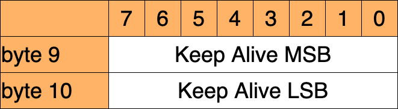
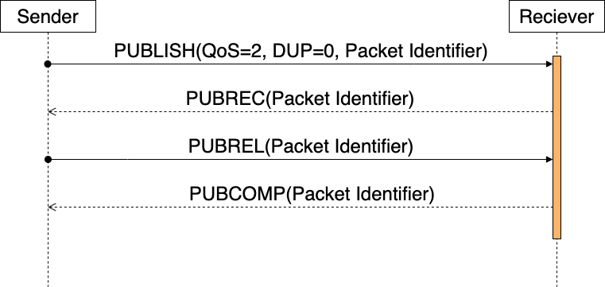

# MQTT3.1.1

## Index

0. Abstract
1. Introduction
2. MQTT制御パケットのフォーマット
3. MQTT制御パケット
4. Operational behavior
5. Security
6. Using WebSocket as a network transport
7. Conformance

## Abstract

### MQTTとは

- OASISが標準化
- 最新の仕様は[MQTT Version 5.0](https://docs.oasis-open.org/mqtt/mqtt/v5.0/mqtt-v5.0.html)
- デファクトスタンダードが[MQTT Version 3.1.1](http://docs.oasis-open.org/mqtt/mqtt/v3.1.1/errata01/os/mqtt-v3.1.1-errata01-os-complete.html#_Toc442180831)
- Pub/Sub型のメッセージメッセージ伝送プロトコル
- 軽量、オープン、シンプルに設計されている
- M2MやIoTのように小さなフットプリントが必要な場合に有効
- TCP/IPのプロトコル上で稼働する
- いわゆるMessageQueueの機能はない

### MQTTの特徴

- 1対多のメッセージ配信を提供するPub/Sub型
- ペイロードの内容に左右されないメッセージ伝送
- ３つのメッセージ配信品質
  - At most once：メッセージ損失あり、メッセージ重複あり
  - At least once：メッセージ損失なし、メッセージ重複あり
  - Exactly once ：メッセージ損失なし、メッセージ重複なし
- 小さなオーバーヘッドとプロトコル交換が最小化
- 異常な切断が発生したときに利害関係者に通知するメカニズム

## 1. Introduction

<!-- header: MQTT 3.1.1 (1. Introduction) -->

### 用語

- Network Connection
- Application Message
- Client
- Server
- Subscription
- Topic Name
- Topic Filter
- Session
- MQTT Control Packet

### 引用規定

- [RFC2119 : RFCの中で必要条件レベルを示すキーワード](http：//www.ietf.org/rfc/rfc2119.txt)
- [RFC3629 : UTF-8、ISO 10646の変換フォーマット](http://www.ietf.org/rfc/rfc3629.txt)
- [RFC5246 : TLS プロトコル v1.2](http://www.ietf.org/rfc/rfc5246.txt)
- [RFC6455 : WebSocketプロトコル](http://www.ietf.org/rfc/rfc6455.txt)
- [Unicode : ユニコード](http://www.unicode.org/versions/latest/)

### データ表現

- 数値データ値
  - ビッグエンディアン順で16ビット
- 文字列
  - テキストフィールドは、UTF-8文字列としてエンコード
  - 各文字列にはバイト数を示す2バイト長のプレフィックスが付与
  - 65535バイトを超える文字列を使用することはできない

## 2. MQTT制御パケットのフォーマット

<!-- header: MQTT 3.1.1 (2. MQTT制御パケットのフォーマット) -->

### MQTT制御パケットの構造

- MQTTは、MQTT制御パケットを交換することで動作する
- MQTT制御パケットは最大3つの部分で構成される

| MQTT制御パケットの部分 | 概要                         |
| :--------------------- | :--------------------------- |
| Fixed header           | 全てのMQTT制御パケットに必要 |
| Variable header        | 一部のMQTT制御パケットに必要 |
| Payload                | 一部のMQTT制御パケットに必要 |

### Fixed header

- 各MQTT制御パケットには、固定ヘッダーが含まれている
- 固定ヘッダーは下図の様に定義される


### MQTT Control Packet type

- `MQTT Control Packet type`は4bitで表現される。

| Value | Name     | Value | Name        | Value | Name       |
| :---- | :------- | :---- | :---------- | :---- | :--------- |
| 0000  | Reserved | 0110  | PUBREL      | 1100  | PINGREQ    |
| 0001  | CONNECT  | 0111  | PUBCOMP     | 1101  | PINGRESP   |
| 0010  | CONNACK  | 1000  | SUBSCRIBE   | 1110  | DISCONNECT |
| 0011  | PUBLISH  | 1001  | SUBACK      | 1111  | Reserved   |
| 0100  | PUBACK   | 1010  | UNSUBSCRIBE |
| 0101  | PUBREC   | 1011  | UNSUBACK    |

### Flag

- `PUBLISH`以外は`MQTT Control Packet type`ごとの固定値
- `PUBLISH`では下表の様に使用

| Bit  | 用途                              |
| :--- | :-------------------------------- |
| 3    | DUB:PUBLISH制御パケットの重複配信 |
| 2    | QoS:PUBLISHサービス品質           |
| 1    | QoS:PUBLISHサービス品質           |
| 0    | RETAIN:PUBLISH保持フラグ          |

### Remaining Length

- `Variable header`と`Payload`のデータを含むバイト数
- 残りの長さフィールドの最大バイト数は4
- 最大268,435,455（256 MB）のサイズの制御パケットを送信可能

### Variable header

- 一部の`MQTT Control Packet`には、`Variable header`が含まれる
- `Variable header`の内容は、パケットタイプによって異なる
- 一般的な`Variable header`に、`Packet Identifier`というものがある
- `Packet Identifier`は、２バイトで構成される
- `Packet Identifier`が付与されるのは、`PUBLISH`,`PUBACK`,`PUBREC`,`PUBREL`,`PUBCOMP`,`SUBSCRIBE`,`SUBACK`,`UNSUBSCRIBE`,`UNSUBACK`

### Payload

- 一部のMQTT制御パケットは、ペイロードが含まる
- `PUBLISH`パケットの場合、アプリケーションメッセージ
- ペイロードを必要とするの下表の通り

| Control Packet | Payload | Control Packet | Payload |
| :------------- | :------ | :------------- | :------ |
| CONNECT        | 必須    | PUBLISH        | 任意    |
| SUBSCRIBE      | 必須    |                |         |
| SUBACK         | 必須    |                |         |
| UNSUBSCRIBE    | 必須    |                |         |

## 3. MQTT制御パケット

<!-- header: MQTT 3.1.1 (3. MQTT制御パケット) -->

### CONNECT

<!-- header: MQTT 3.1.1 (3. MQTT制御パケット - CONNECT) -->

- ClientがServerへの接続を要求する
- ネットワーク接続確立後、ClientからServerに送信される最初のパケットは、`CONNECT`パケット
- Serverは、Clientから２回目の`CONNECT`パケットを受信した際、プロトコル違反として、Clientを切断する
- `Payload`には、Client識別子、WillTopic、Willメッセージ、ユーザー名、パスワードを指定

#### CONNECT(Fixed header)

- `CONNECT`の`Fixed header`は下図の通り
- `Remaining Length`には、`Variable header`のサイズ(10byte)と`Payload`のサイズを足した値を指定する


#### CONNECT(Variable header)

- `CONNECT`の`Variable header`には４つのフィールドがある
  - プロトコル名
  - プロトコルレベル
  - 接続フラグ
  - キープアライブ

##### CONNECT(Variable header) - プロトコル名

- プロトコル名は、UTF-8で"MQTT"というプロトコル名が入る


##### CONNECT(Variable header) - プロトコルレベル

- Clientが使用するプロトコルのリビジョンレベル
- MQTT 3.1.1での値は4（0x04）


##### CONNECT(Variable header) - 接続フラグ1

- MQTT接続の動作を指定するいくつかのパラメーターが含まれる
- ペイロード内のフィールドの有無も示す


##### CONNECT(Variable header) - 接続フラグ2

- Clean Session
  - セッション状態の処理を指定
  - `CleanSession`が`0`の時
    - セッション（Client識別子）に基づいて通信を再開
    - セッションがない場合、Serverは新しいセッションを作成
    - ClientとServerが切断された後、セッションを保存
    - セッション切断時、ServerはQoS1/QoS2メッセージを保管
  - `CleanSession`が`1`の時
    - セッションはネットワーク接続と同じ期間でのみ持続

##### CONNECT(Variable header) - 接続フラグ3

- Clear Session
  - Clientのセッション状態
    - Serverに送信中のQoS1/QoS2メッセージ。
    - Serverから受信中のQoS2メッセージ。
  - Serverのセッションの状態
    - Clientに送信中のQoS1/QoS2メッセージ
    - Clientから受信中のQoS2メッセージ。

##### CONNECT(Variable header) - 接続フラグ4

- Will Flag
  - `Will Flag`が`1`の時
    - Serverは`DISCONNECT`を受信するまで`Will Message`を保存
    - ネットワーク接続が閉じられたときに`Will Message`を`PUBLISH`
      - ServerがI/Oエラーやネットワーク障害を検出
      - ClientがKeep Alive時間内に通信できなかった
      - `DISCONNECT`せずにネットワーク接続を終了
      - プロトコルエラーによりネットワーク接続を切断
    - `Payload`に`Will Topic`と`Will Message`が必要

##### CONNECT(Variable header) - 接続フラグ5

- Will Flag
  - `Will Flag`が0の時
    - `Will QoS`と`Will Retain`は`0`
    - `Payload`に`Will Topic`と`Will Message`は不要
    - ネットワーク接続の終了時に`Will Message`を`PUBLISH`しない
  - 障害発生時は、再起動後に`Will Message`を`PUBLISH`しても良い

##### CONNECT(Variable header) - 接続フラグ6

- Will QoS
  - `Will Message`を`PUBLISH`するときのQoS
  - `Will Flag`が`0`の時、`Will QoS`は`0`
  - `Will Flag`が`1`の時、`Will QoS`は`0`, `1`, `2`のいずれか
- Will Retain
  - `Will Flag`が`0`の時、`Will Retain`は`0`
  - `0`の時、Serverは`Will Message`を非保持メッセージとして発行
  - `1`の時、Serverは`Will Message`を保持メッセージとして発行

##### CONNECT(Variable header) - 接続フラグ7

- User Name Flag
  - `User Name Flag`が`0`の時、`Payload`にユーザー名が不要
  - `User Name Flag`が`1`の時、`Payload`にユーザー名が必要
- Password Flag
  - `User Name Flag`が`0`の時、`Password Flag`は`0`
  - `0`の時、`Payload`にパスワードが不要
  - `1`の時、`Payload`にパスワードが必要

##### CONNECT(Variable header) - キープアライブ



- Keep Aliveは、秒単位に指定
- Keep Aliveを維持するのはClientの責任
- Keep Aliveを維持するためにClientは`PINGREQ`を使用
- Keep Aliveの値が0の場合は、Keep Alive機構をオフにする
- Keep Aliveの最大値は18時間12分15秒

#### CONNECT(Payload)

- `Variable header`のフラグによって、フィールド内容が決まる
- 必ず以下の順番でフィールが定義する
  - Client Identifier
  - Will Topic
  - Will Message
  - User Name
  - Password

#### CONNECT(Payload) - Client Identifier

- ServerがClientを識別する固有のID
- セッション状態を識別するために使用
- Client識別子(ClientId)は必須
- UTF-8でエンコードされた1〜23バイトの文字列
- ゼロバイトのClientIdを使う場合、`CleanSession`は`1`

#### CONNECT(Payload) - Will Topic

- `Will Flag`が`1`の時、`Will Topic`を付与
- `Will Topic`は、UTF-8でエンコードされた文字列

#### CONNECT(Payload) - Will Message

- `Will Flag`が`1`のとき、`Will Message`を付与
- `Will Message`は、`Will Topic`に`PUBLISH`されるメッセージ

#### CONNECT(Payload) - User Name

- `User Name Flag`が`1`の時、`User Name`を付与
- `User Name`は、UTF-8でエンコードされた文字列
- Serverが認証と認可のために使用

#### CONNECT(Payload) - Password

- `Password Flag`が`1`の時、`Password`を付与
- `Password`は、0～65535バイトのバイナリデータ

#### CONNECT(Response)

- Serverは、以下の手順で接続の検証
  1. `CONNECT`を受信しない場合、は接続を閉じるべき
  2. `CONNECT`が仕様に準拠していない場合はネットワーク接続を終了
  3. 認証と認可のチェック。失敗した場合、0以外の`CONNACK`を送信
- 検証が成功した場合、Serverは以下の手順を実行
  1. `ClientId`が存在する場合、ServerはClientを切断
  2. Serverは、CleanSessionの処理を実行
  3. Serverは`CONNACK`を送信
  4. メッセージ配信とキープアライブ監視を開始

#### CONNECT(Actions)

- `CONNECT`ではActionはない

### CONNACK

<!-- header: MQTT 3.1.1 (3. MQTT制御パケット - CONNACK) -->


- 接続要求の承認
- `CONNECT`に応答してServerが送信する
- ServerからClientに送信されるのは`CONNACK`

#### CONNACK(Fixed header)

- `CONNACK`の`Fixed header`は下図の通り
- `Remaining Length`は`2`


#### CONNACK(Variable header)

- `CONNACK`の`Variable header`には２つのフィールドがある。
  - Connect Acknowledge Flags
  - Connect Return code


#### CONNACK(Variable header) - Connect Acknowledge Flags

- Bit7-Bit1までは、`0`固定
- Bit0は`Session Present`
  - `CleanSession`が`1`だった時`0`
  - `CleanSession`が`0`だった時はセッション有無で決定
    - セッションがある時は`1`
    - セッションがない時は`0`

#### CONNACK(Variable header) - Connect Return code

下表を参照。

| Value     | Description                                 |
| :-------- | :------------------------------------------ |
| 0x00      | 接続を許可                                  |
| 0x01      | MQTTプロトコルのレベルをサポートしていない  |
| 0x02      | Serverで許可されていないClient identifier |
| 0x03      | MQTTサービスが利用できない                  |
| 0x04      | ユーザー名またはパスワードが不正            |
| 0x05      | 接続する権限がない                          |
| 0x06-0xFF | 将来使用のための予約                        |

#### CONNACK(Payload)

- `CONNACK`は`Payload`を持たない

#### CONNACK(Response)

- `CONNACK`は`Response`を持たない

#### CONNACK(Actions)

- `CONNACK`は`Action`を持たない

### PUBLISH

<!-- header: MQTT 3.1.1 (3. MQTT制御パケット - PUBLISH) -->

- `PUBLISH`は、ClientからServerへ、またはServerからClientへ,アプリケーションメッセージを伝送する

#### PUBLISH(Fixed header)

- `PUBLISH`の`Fixed header`は下図の通り


#### PUBLISH(Fixed header) - DUP

- QoS0の時、`DUP`は`0`で固定
- `DUP`が`0`の時は、初回の`PUBLISH`であることを示す
- `DUP`が`1`の時は、再送の`PUBLISH`である可能性を示す
- `DUP`の値は、Serverから`PUBLISH`する際の`DUP`に伝搬しない

#### PUBLISH(Fixed header) - QoS

- メッセージの配信に対する保証のレベルを示す

| QoS Value | Description                 |
| :-------: | :-------------------------- |
|    00     | At most once delivery       |
|    01     | At least once delivery      |
|    10     | Exactly once delivery       |
|    11     | Reserved – must not be used |

#### PUBLISH(Fixed header) - RETAIN

- `RETAIN`が`1`の時、ServerはメッセージとそのQoSを保存する
- Topicに`SUBSCRIBE`された時、保存したメッセージを送信する
- Serverは、`RETAIN`が`1`のQoS0のメッセージを受信した際、保存したメッセージを全て破棄する
- `RETAIN`が`0`の時、Serverはメッセージを保存しない

#### PUBLISH(Variable header)

- `PUBLISH`の`Variable header`には２つのフィールドがある
  - Topic Name
  - Packet Identifier

#### PUBLISH(Variable header) - Topic Name

- `Topic Name`は、`Payload`が公開されるチャネルを識別する
- `Topic Name`は、UTF-8でエンコードされた文字列
- `PUBLISH`の`Topic Name`は、ワイルドカードを含んではならない
- Serverは`TopicName`を上書きすることが許される

#### PUBLISH(Variable header) - Packet Identifier

- `Packet Identifier`は、QoS1またはQoS2の`PUBLISH`にのみ記述

#### PUBLISH(Payload)

ペイロードには、公開されているアプリケーションメッセージが含まれています。データの内容や形式はアプリケーションによって異なります。ペイロードの長さは、固定ヘッダの残りの長さフィールドから可変ヘッダの長さを差し引くことで計算できる。PUBLISHパケットにゼロ長のペイロードを含めることは有効です。

#### PUBLISH(Response)

- `PUBLISH`の受信者は、QoSによって応じた応答を行う

| QoS Level | Response |
| :-------- | :------- |
| QoS 0     | None     |
| QoS 1     | PUBACK   |
| QoS 2     | PUBREC   |

#### PUBLISH(Actions)

- Clientは`PUBLISH`を使ってメッセージをServerに送信し、一致するSubscriptionを持つClientに配信する
- Serverは`PUBLISH`を使用して、一致するSubscriptionを持つ各Clientにメッセージを送信する
- `PUBLISH`されたメッセージが複数のSubscriptionにマッチした際（Topicフィルタにはワイルドカードが許容されれている）、Serverは一致するすべてのSubscriptionの最大QoSを尊重して、Clientにメッセージを配信しなければならない

### PUBACK

<!-- header: MQTT 3.1.1 (3. MQTT制御パケット - PUBACK) -->

- `PUBLISH`確認応答
- `PUBACK`は、QoS1の`PUBLISH`に対する応答

#### PUBACK(Fixed header)

- `PUBACK`の`Fixed header`は下図の通り
- `PUBACK`の`Remaining Length`は`2`で固定


#### PUBACK(Variable header)

- `PUBLISH`の`Packet Identifier`を書き込む


#### PUBACK(Payload)

- `PUBLISH`の`Payload`を持たない

#### PUBACK(Response)

- `PUBLISH`の`Response`を持たない

#### PUBACK(Actions)

- 詳細は別途記述

### PUBREC

<!-- header: MQTT 3.1.1 (3. MQTT制御パケット - PUBREC) -->

- `PUBLISH`受信（QoS2 `PUBLISH`受信、パート1）
- `PUBREC`は、QoS2の`PUBLISH`に対する応答であり
- QoS 2プロトコル交換の2番目のパケット

#### PUBREC(Fixed header)

- `PUBREC`の`Fixed header`は下図の通り
- `PUBREC`の`Remaining Length`は`2`で固定


#### PUBREC(Variable header)

- `PUBLISH`の`Packet Identifier`を書き込む


#### PUBREC(Payload)

- `PUBREC`の`Payload`を持たない

#### PUBREC(Actions)

- 詳細は別途記述

### PUBREL

<!-- header: MQTT 3.1.1 (3. MQTT制御パケット - PUBREL) -->

- `PUBLISH`のリリース（QoS2`PUBLISH`受信、パート２）
- `PUBREL`は、`PUBREC`に対する応答

#### PUBREL(Fixed header)

- `PUBREL`の`Fixed header`は下図の通り
- `PUBREL`の`Remaining Length`は`2`で固定


#### PUBREL(Variable header)

- `PUBREC`の`Packet Identifier`を書き込む


#### PUBREL(Payload)

- `PUBREL`は`Payload`を持たない

#### PUBREL(Actions)

- 詳細は別途記述

### PUBCOMP

<!-- header: MQTT 3.1.1 (3. MQTT制御パケット - PUBCOMP) -->

- `PUBLISH`完了（QoS2`PUBLISH`受信、パート3）
- `PUBCOMP`は、`PUBREL`に対する応答です。

#### PUBCOMP(Fixed header)

- `PUBCOMP`の`Fixed header`は下図の通り
- `PUBCOMP`の`Remaining Length`は`2`で固定


#### PUBCOMP(Variable header)

- `PUBREL`の`Packet Identifier`を書き込む


#### PUBCOMP(Payload)

- `PUBCOMP`は`Payload`を持たない

#### PUBCOMP(Actions)

- 詳細は別途記述

### SUBSCRIBE

<!-- header: MQTT 3.1.1 (3. MQTT制御パケット - SUBSCRIBE) -->

- Topicの購読
- `SUBSCRIBE`は、1 つ以上のSubscriptionを作成する
- Subscriptionは、1つ以上のTopicに対するClientの関心
- Serverは、SubscriptionにマッチするTopicに`PUBLISH`されたメッセージをClientに`PUBLISH`する
- `SUBSCRIBE`は、ServerがClientにメッセージを送信できる最大QoSをSubscriptionごとに指定

#### SUBSCRIBE(Fixed header)

- `SUBSCRIBE`の`Fixed header`は下図の通り
- `Remaining Length`には、`Variable header`のサイズ(2byte)と`Payload`のサイズを足した値を指定


#### SUBSCRIBE(Variable header)

- `Variable header`には`Packet Identifier`を記述

#### SUBSCRIBE(Payload)

- 購読を望むTopic指定したTopicFilterのリストを記述。
- Serverはワイルドカードを含むTopicFilterをサポート(SHOULD)
- 各TopicFilterの後には、Requested QoS(ServerがClientにメッセージを送信できる最大QoSレベル)が続く


#### SUBSCRIBE(Response)

- `SUBSCRIBE`を受け取たとき、`SUBACK`で応答する
- `SUBACK`は、`SUBSCRIBE`と同じ`Packet Identifier`を持つ
- `SUBACK`送信する前に、`PUBLISH`の送信を開始しても良い
- TopicFilterを受けると新しいSubscriptionを生成する
- 同じTopicFilterのSubscriptionを受けた場合は完全に置き換える
- `SUBACK`は、各TopicFilter/QoSペアのリターンコードを含む
- `PUBLISH`されたメッセージのQoSが`SUBSCRIBE`で指定されたQoSのレベルより低い場合、QoSレベルを格下げしてメッセージを送信

### SUBACK

<!-- header: MQTT 3.1.1 (3. MQTT制御パケット - SUBACK) -->

- サブスクライブ確認応答
- `SUBACK`は、`SUBSCRIBE`の受信と処理を確認するために送信する

#### SUBACK(Fixed header)

- `SUBACK`の`Fixed header`は下図の通り
- `Remaining Length`には、`Variable header`のサイズ(2byte)と`Payload`のサイズを足した値を指定する


#### SUBACK(Variable header)

- `SUBACK`の`Variable header`には、`SUBSCRIBE`の`Packet Identifier`を記述する


#### SUBACK(Payload)

- `Payload`には、ReturnCodeのリストを含む
- ReturnCodeは`SUBSCRIBE`のTopicFilterに対応する
- ReturnCodeの順番は、`SUBSCRIBE`のTopickFilterの順番に一致


### UNSUBSCRIBE

<!-- header: MQTT 3.1.1 (3. MQTT制御パケット - UNSUBSCRIBE) -->

- Topic購読の解除

#### UNSUBSCRIBE(Fixed header)

- `UNSUBSCRIBE`の`Fixed header`は下図の通り
- `Remaining Length`には、`Variable header`のサイズ(2byte)と`Payload`のサイズを足した値を指定


#### UNSUBSCRIBE(Variable header)

- `UNSUBSCRIBE`の`Variable header`には、`SUBSCRIBE`の`Packet Identifier`を記述する


#### UNSUBSCRIBE(Payload)

- Clientが購読をやめるTopicFilterのリストを持つ
- 少なくとも一つのTopicFilterを含まなければならない

#### UNSUBSCRIBE(Response)

- Serverが持つ完全一致するTopicFilterのSubscriptionを削除する
- ServerがSubscriptionを削除する場合
  - ServerはClientへの新規メッセージ配信を停止
  - ServerはClientへ配信中のQoS1/QoS2メッセージを配信しきる
  - ServerはClientへの送信バッファ内のメッセージを配信してよい
- `UNSUBSUBCRIBE`に対し、`UNSUBACK`で応答する

### UNSUBACK

<!-- header: MQTT 3.1.1 (3. MQTT制御パケット - UNSUBACK) -->

- Topic購読の解除確認
- `UNSUBACK`は`UNSUBSCRIBE`の受信を受信を確認するために送信

#### UNSUBACK(Fixed header)

- `UNSUBACK`の`Fixed header`は下図の通り
- `UNSUBACK`の`Remaining Length`は`2`で固定


#### UNSUBACK(Variable header)

- `UNSUBSCRIBE`の`Packet Identifier`を含む


#### UNSUBACK(Payload)

- `UNSUBSCRIBE`は`Payload`を持たない

### PINGREQ

<!-- header: MQTT 3.1.1 (3. MQTT制御パケット - PINGREQ) -->

- PINGリクエスト
- `PINGREQ`はClientからServerに以下の目的で使用できる
  - Clientが生存していることをServerに伝える
  - Serverが生存していることを確認する
  - ネットワーク接続がアクティブであることを通知する
- Keep Alive処理で使用される

#### PINGREQ(Fixed header)

- `PINGREQ`の`Fixed header`は下図の通り


#### PINGREQ(Variable header)

- `PINGREQ`は`Variable header`を持たない

#### PINGREQ(Payload)

- `PINGREQ`は`Payload`を持たない

#### PINGREQ(Response)

- `PINGREQ`の応答として`PINGRESP`が送信される

### PINGRESP

<!-- header: MQTT 3.1.1 (3. MQTT制御パケット - PINGRESP) -->

- PINGレスポンス
- `PINGRESP`は`PINGREQ`の応答
- Serverが生存していることを示す
- Keep Alive処理で使用される

#### PINGRESP(Fixed header)

- `PINGRESP`の`Fixed header`は下図の通り


#### PINGRESP(Variable header)

- `PINGRESP`は`Variable header`を持たない

#### PINGRESP(Payload)

- `PINGRESP`は`Payload`を持たない

### DISCONNECT

<!-- header: MQTT 3.1.1 (3. MQTT制御パケット - DISCONNECT) -->

- 接続解除の通知
- ClientからServerに送信される最後のパケット
- Clientがきれいに切断していることを示す

#### DISCONNECT(Fixed header)

- `DISCONNECT`の`Fixed header`は下図の通り


#### DISCONNECT(Variable header)

- `DISCONNECT`は`Variable header`を持たない

#### DISCONNECT(Payload)

- `DISCONNECT`は`Payload`を持たない

#### DISCONNECT(Response)

- Clientは、DISCONNECTパケットを送信した後
  - ネットワーク接続を閉じなければならない
  - そのネットワーク接続では、それ以上コントロールパケットを送信してはならない
- ServerはDISCONNECTを受信した後
  - 接続に関連するWill Messageを公開せずに廃棄する
  - Clientがネットワークを閉じていない場合、ネットワーク接続を閉じるべき

## 4. Operational behavior

<!-- header: MQTT 3.1.1 (4. Operational behavior) -->

### 4.1 状態の保存

- ClientとServerは、セッション期間中、セッション状態を保存
- セッションは、少なくともネットワーク接続がある間は継続
- `Retained message`はServerのセッション状態の一部ではない
- Serverは、Clientからの削除依頼を受けるまで`Retained message`を保持すべき

### 4.2 ネットワーク接続

- 順序を保証し、データ欠損のないトランスポート層を求める
- MQTT3.1では、TCP/IPを指定
- MQTT3.1.1では、TCP/IPだけでなくTLS, WebSocketも許容
- MQTTのTLS通信用にTCPポート8883、非TLS通信用にTCPポート1883がIANAに登録

### 4.3 Quality of Service levels and protocol flows

- MQTTは、QoS(Quality of Service)に従って、メッセージを配信
- 配信は、1つのSenderから1つのReceiverへメッセージを配信
- Serverが複数Clientに配信する場合、各Clientを独立して扱う
- メッセージをClientに配信する際に使用するQoSは、受信した際のQoSと異なる可能性がある。

#### 4.3.1 QoS 0: At most once delivery

- メッセージは、基礎となるネットワークの能力に応じて配信される
- 受信者からの応答はなく、送信者によるリトライも行われない
- メッセージは受信者に一度だけ到着するか、まったく到着しないかのどちらか
- 送信者は
  - QoS=0, DUP=0の`PUBLISH`を送信
- Receiverは
  - `PUBLISH`を受信すると、メッセージの所有権を獲得

#### 4.3.1 QoS 0: At most once delivery - flow


#### 4.3.2 QoS 1: At least once delivery

- メッセージが少なくとも一度は受信者に到着することを保証
- `Variable header`には、`Packet identifier`が含まれる
- 送信者は
  - QoS=1、DUP=0の`PUBLISH`を送信
  - `PUBACK`を受信するまで、`PUBLISH`を「未確認」として扱う
- 受信者は
  - `PUBLISH`に対し`PUBACK`で応答
  - `DUP`の設定に関わらず`PUBLISH`を新しい配信として扱う

#### 4.3.2 QoS 1: At least once delivery - flow


#### 4.3.3 QoS 2: Exactly once delivery - 1

- メッセージの損失や重複が許されない場合に使用
- オーバーヘッドが増加
- `Variable header`には、`Packet identifier`が含まれる
- 送信者は
  - QoS=2, DUP=0の`PUBLISH`を送信
  - `PUBREC`を受信するまで、`PUBLISH`を「未確認」として扱う
  - `PUBREC`を受信すると、`PUBREL`を送信する
  - `PUBCOMP`を受信するまで、`PUBREL`を「未確認」として扱う
  - `PUBREL`を送信した後は、PUBLISHを再送信してはならない

#### 4.3.3 QoS 2: Exactly once delivery - 2

- 受信機は
  - `PUBLISH`を受信すると、`PUBREC`で応答する
  - `PUBREL`受信するまで、`PUBLISH`に対して`PUBREC`で確認する
  - `PUBREL`を受信すると、`PUBCOMP`を送信する

#### 4.3.3 QoS 2: Exactly once delivery - flow



### 4.4 Message delivery retry

- CleanSessionが0に設定された状態でClientが再接続した場合、ClientとServerの両方は、確認されていない`PUBLISH`（QoS>0の場合）と`PUBREL`を元のパケット識別子を使って再送信する
- ClientまたはServerがメッセージの再送を要求される唯一の状況

### 4.5 Message receipt

- Serverがメッセージを受信したとき、一致するSubscriptionを持つClientのセッションにメッセージを追加する
- Clientは作成したSubscriptionに応答してメッセージを受け取とる
- Subscriptionに一致しないメッセージを受け取ることもある
- ServerがClientにSubscriptionを自動的に割り当てた場合に起こる
- `UNSUBSCRIBE`の進行中にメッセージを受け取ることもできる
- Clientは、受信した`PUBLISH`のメッセージを処理するかどうかに関わらず、QoSルールに従って、その`PUBLISH`を確認する

### 4.6 Message ordering

- `PUBLISH`を再送するときは、元の順序で再送信する(QoS1/QoS2)
- `PUBLISH`を受信した順に、`PUBACK`を送信する(QoS1)
- `PUBLISH`を受信した順に、`PUBREC`を送信する(QoS2)
- `PUBREC`を受信した順に、`PUBREL`を送信する(QoS2)
- Serverは、Topicを「順序付きTopic」として扱う
- Serverは、「順序なしTopic」として扱う機構を提供してもよい
- Serverが順序付きTopicに発行されたメッセージを処理する場合、任意のClientから受信した順に`PUBLISH`を送信する

### 4.7 Topic Names and Topic Filters

- 4.7.1 Topic wildcards
  - 4.7.1.1 Topic level separator
  - 4.7.1.2 Multi-level wildcard
  - 4.7.1.3 Single level wildcard
- 4.7.2 Topics beginning with $
- 4.7.3 Topic semantic and usage

#### 4.7.1 Topic wildcards

- Topic level separator
  - Topic名を構造化をする
  - Topic名が複数の「Topic level」に分割する
- ワイルドカード
  - Topic Filterには、ワイルドカード文字を含めることができる
  - 複数のTopicを一度に購読することができる
  - ワイルドカード文字はTopic Filterーで使用できる
  - Topic名の中では使用してはならない

##### 4.7.1.1 Topic level separator

- Topic level separatorは、Forward Slash('/')で表現する
- Topic Tree内の各レベルを区切り、Topic名に階層構造を与える
- Topic FilterやTopic名のどこにでも出現する
- 隣り合ったTopic level separatorは、ゼロ長のTopic levelを示す

##### 4.7.1.2 Multi-level wildcard

- Multi-level wildcardは、Number sign('#')で表現する
- Topic内の任意の数のレベルにマッチする
- Topic Filterで指定された最後の文字でなければならない
- 単独で指定するか、Topic level separatorの後に指定する

```text
sport/tennis/player1/#

sport/tennis/player1
sport/tennis/player1/ranking
sport/tennis/player1/score/wimbledon
```

##### 4.7.1.3 Single level wildcard

- Single level wildcardは、Plus sign('+')で表現する
- Topic内の1レベル分にのみマッチする
- Topic Filterのどのレベルでも使用できる
- Topic Filterの複数レベルで使用できる
- Multi-level wildcardと一緒に使用することができる

```text
sport/tennis/+

sport/tennis/player1 (マッチ)
sport/tennis/player2 (マッチ)
sport/tennis/player1/ranking (マッチしない)
```

#### 4.7.2 Topics beginning with $

- Serverは、$文字で始まるTopic名を他目的で使用してもよい
- Serverは、ワイルドカード(#または+)で始まるTopic Filterと、$文字で始まるTopic名をマッチさせてはいけない
- Serverは、ClientがそのようなTopic名を使って他のClientとメッセージを交換するのを防ぐべき

#### 4.7.3 Topic semantic and usage

- Topic名とTopic Filterは、1文字以上の長さ
- Topic名とTopic Filterは、大文字と小文字を区別する
- Topic名とTopic Filterは、スペース文字を含めることができる
- Topic名とTopic Filterは、'/' 文字だけでも有効
- Topic名とTopic Filterは、UTF-8で65,535バイト未満
- 先頭または末尾に「/」で、別のTopic名やTopic Filterが作成される

### 4.8 Handling errors

- ClientやServerがプロトコル違反に遭遇した場合、ネットワーク接続を閉じる
- ClientやServerの実装では、MQTTパケットの処理を妨げるエラーが発生することがある
- ClientやServerが処理中にエラーに遭遇した場合、そのコントロールパケットを受信したネットワーク接続を閉じなければなりません（MQTT-4.8.0-2）。Serverーが一過性のエラーを検出した場合、他のClientとのやりとりを切断したり、その他の影響を与えるべきではありません。

## 5. Security

<!-- header: MQTT 3.1.1 (5. Security) -->

### 5.1 Introduction

- 本章はガイダンスとしてのみ提供
- TLS上では8883ポート（IANA名：secure-mqtt）の使用を強く推奨
- MQTT実装には以下のようなメカニズムの提供が必要
  - ユーザーとデバイスの認証
  - Serverーリソースへのアクセスの認証
- セキュリティ機能は実装者の責任、一般的にTLSを使うことで実現

### 5.2 セキュリティと認証

- 特定の業界セキュリティ規格への適合が必要な場合がある

### 5.3 軽量暗号と制約のあるデバイス

- AES[^1]とDES[^2]が広く採用されている
- ISO 29192では、制約の多い「ローエンド」デバイスで動作するように特別に調整された暗号プリミティブを推奨

[^1] AES : Advanced Encryption Standard
[^2] DES : Data Encryption Standard

### 5.4 実装上の注意点

- MQTTの実装／使用には、考慮すべきセキュリティ上の問題がある
- 本節を、「チェックリスト」と考えるべきではない

#### 5.4.1 ServerによるClientの認証

- `CONNECT`には、UsernameとPasswordがある。
実装では、どのように認証するかを選択する。独自の認証メカニズムを提供したり、LDAPやOAuthなどの外部認証システムを使用したり、OSの認証を利用したりすることができる。
- 認証データを平文で渡したり、難読化したり、必要としない実装は、中間者攻撃やリプレイ攻撃を引き起こす可能性がある
- 仮想プライベートネットワーク（VPN）を使用すると、データが許可されたClientからのみ受信されていることを確認できる
- TLSを使用する場合、Clientから送信されたSSL証明書は、ServerがClientを認証するために使用できる

#### 5.4.2 ServerによるClientの認証

- 認証の結果に基づいて、リソースへのアクセスを制限してよい
- Clientからの提供情報で、リソースへのアクセスを制限してよい
- Clientからの提供情報には、Username、Client Identifier、Clientのホスト名/IPアドレスなどがある

#### 5.4.3 ClientによるServerーの認証

- MQTTはClientがServerを認証する仕組みを持たない
- TLSを使用する時、Serverから送信されるSSL証明書は、ClientがServerを認証するために使用できる
- 単一IPから複数ホスト名でMQTTを提供する実装では、RFC6066で定義されているTLSのServer Name Indication拡張機能を使い、Clientは接続しようとしているServerのホスト名をServerに伝えることができる
- ClientとServerの間にVPNを使うことで、Clientが意図したServerServerーに接続していることを確認できる

#### 5.4.4 メッセージと制御パケットの整合性

- アプリケーションはメッセージにHASH値を含められる
- 発行制御パケットのコンテンツの整合性を確保することができる
- TLSは、ネットワーク上で送信されるデータの整合性を検証するためのHASHアルゴリズムを提供する
- VPNを使用すると、ネットワークの整合性を確保することができる

#### 5.4.5 メッセージと制御パケットのプライバシー

- TLSは、ネットワーク上で送信されるデータを暗号化できる
- TLSの中にはデータを暗号化しない方法もあるが、プライバシーを守るために使用を避けるべき
- アプリケーションは、メッセージを独自に暗号化し、プライバシーを確保することがでる
- VPNを使用すると、ネットワークのプライバシーを提供できる

#### 5.4.6  メッセージ送信の否認防止

- アプリケーション設計者は、エンドツーエンドの否認防止を実現するための適切な戦略を検討する必要があるかもしれません

#### 5.4.7 ClientとServerーの危険性の検出

- TLSを使用するClientおよびServerは、SSL証明書が、ホスト名に関連付けられていることを確認する必要がある
- TLSを使用するClientとServerは、失効した証明書が使用されるのを防ぐために、CRL[^1]とOSCP[^2]をチェックすることができる

[^1] Certificate Revocation Lists(RFC5280)
[^2] Online Certificate Status Protocol(RFC6960)

#### 5.4.8 異常な挙動の検出

- Serverはインシデントを検出するために、Clientを監視する
  - 接続試行や認証試行の繰り返し
  - 接続の異常終了
  - トピックスキャン(多くのトピックの送信または購読を試みる)
  - 送れないメッセージの送信（トピックの購読者がいない）
  - 接続してもデータを送信しないClient
- Serverは、セキュリティ違反したClientを切断する
- Serverは、Clientのブロックリストを作ることがある

#### 5.4.9 その他のセキュリティに関する注意事項

- ClientまたはServerのSSL証明書が失われたり危殆化（きたいか）した可能性がある場合、SSL証明書を失効させる
- ClientまたはServerの認証情報が失われたり危殆化した可能性がある場合、認証情報を失効させる

#### 5.4.10 SOCKSの使用について

- Clientは、ネットワーク接続にSOCKSの使用が必要な場合がある
- MQTT実装の中には、SOCKSを使用して別の安全なトンネル(SSHなど)を利用するものもある
- SOCKSを使用する場合、匿名とユーザ名/パスワード認証の両方のSOCKSプロトコルをサポートすべき
- SOCKS認証はプレーンテキストで行われる可能性があることに注意し、MQTTServerへの接続に同じ認証情報を使用しないようにすべき

#### 5.4.11 セキュリティプロファイル

- セキュリティをMQTTに適用可能なプロファイルとして考える

##### 5.4.11.1 明確なコミュニケーションプロフィール

クリアな通信プロファイルを使用する場合、MQTTはオープンネットワーク上で実行され、追加の安全な通信メカニズムはない

##### 5.4.11.2 セキュアなネットワーク通信プロファイル

- セキュアネットワーク通信プロファイルを使用する場合、MQTTは、VPNや物理的にセキュアなネットワークなど、セキュリティコントロールされた物理的または仮想的なネットワーク上で実行する

##### 5.4.11.3 セキュアなトランスポートプロファイル

- セキュリティで保護されたトランスポートプロファイルを使用する場合、MQTTは物理的または仮想ネットワーク上で、認証、整合性、プライバシーを提供するTLSを使用して実行する
- TLSClient認証は、UsernameとPasswordフィールドで提供されるMQTTClient認証に加えて、あるいはそれに代えて使用することができる

##### 5.4.11.4 業界固有のセキュリティプロファイル

- MQTTは、業界固有のプロファイルに合わせて設計されることが予想される
- それぞれが脅威モデルとその脅威に対処するための特定のセキュリティ・メカニズムを定義している

## 6. ネットワークトランスポートとしてのWebSocket

<!-- header: MQTT 3.1.1 (6. Using WebSocket as a network transport) -->

- MQTTがWebSocketで伝送される場合は、以下の条件が適用される
- MQTTはWebSocketのバイナリデータフレームで送信する
- データフレームに複数または部分的なMQTTパケットを含められる
- Clientは、WebSocket Sub Protocolsのリストに"mqtt"を含める
- Serverが選択して返すWebSocket Sub Protocol名は"mqtt"
- WebSocket URIは、MQTTプロトコルに影響を与えない

### 6.1 IANAに関する考察

IANAに対し、WebSocket MQTTサブプロトコルを"WebSocket Subprotocol Name"レジストリに以下のデータで登録することを要求

- サブプロトコル識別子（Subprotocol Identifier)
  - mqtt
- サブプロトコル共通名（Subprotocol Common Name)
  - mqtt
- サブプロトコルの定義
  - <http://docs.oasis-open.org/mqtt/mqtt/v3.1.1/mqtt-v3.1.1.html>

## 7. 適合性

<!-- header: MQTT 3.1.1 (7. Conformance) -->

- MQTT仕様は、MQTT ClientとMQTT Serverの適合性を定義
- MQTT ClientとMQTT Serverの両方に準拠してもよい
- Serverは、MQTT ClientとMQTT Serverの両方に適合する
- 他の適合した実装と相互運用するために、仕様外で定義された拡張機能の使用を要求してはならない

## Fin

<!-- header: MQTT 3.1.1 -->
