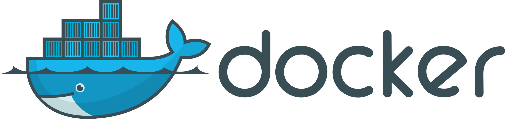
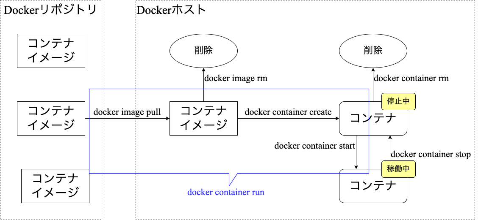
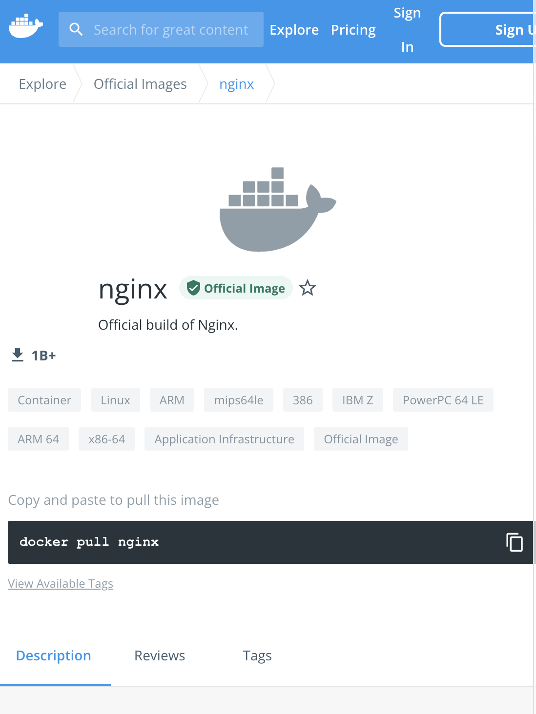
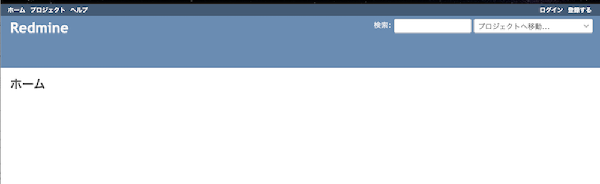

# Dockerを使う



## 前提

<!-- header: 前提 -->

dockerはやる
docker-composeはやる
swamはやらない
imageはやらない
DockerFileはやらない

nginx
redmine
mysql

## 目次

1. Dockerとは
2. Dockerのコンテナ
3. Dockerのボリューム
4. Dockerのネットワーク
5. Dockerイメージの作成
6. docker-compose

## Dockerとは

<!-- header: Dockerとは -->

Dockerは、コンテナ型の仮想環境を作成、配布、実行するためのプラットフォームです。アプリケーションやサービスの実行に必要な各種リソースを再配布可能な形式にパッケージし、隔離された環境で実行できるようにします。

これらにより、以下のような利点が生まれます。

1. どこでも、誰でも同じ環境が作れる
2. 作成した環境を配布しやすい
3. スクラップ＆ビルドが容易にできる

### 仮想化テクノロジーの比較

1. ハイパーバイザー型
   - ハードウェアの仮想化をハイパーバイザーの上でOSを実行
   - ホスト型と比べ高いパフォーマンスが得られる
2. ホスト型
   - ホストOSに仮想化ソフトを道入し、その上でゲストOSを実行
   - ハードウェアの抽象化が行いやすく導入が容易
3. コンテナ型
   - プロセスの実行環境を仮想化する
   - カーネルを含むOS全体を共有するため、リソース効率が良い

### Dockerのアーキテクチャ（アーキテクチャ概要図）


### Dockerのアーキテクチャ（概要説明1）

- **コンテナおよび仮想リソース**
  - コンテナイメージ
    - アプリケーションやサービスを実行するためのテンプレート
    - コンテナイメージから複数のコンテナを作成する
  - コンテナ
    - Dockerにおけるアプリケーション実行単位
    - ネットワークやファイルシステムなどは他プロセスや他コンテナから隔離されている。

### Dockerのアーキテクチャ（概要説明2）

- **コンテナおよび仮想リソース**
  - ボリューム
    - コンテナ間でデータを引き継げるようにするためのもの
    - ホスト環境とファイルを共有するためのマウントもできる
  - ネットワーク
    - コンテナに対するネットワーク割り当てを行うもの
    - ホスト環境のポートに割り当てるポートマッピングもできる

### Dockerのアーキテクチャ（概要説明3）

- **Docker Engine**
  - Dockerデーモン
    - 仮想環境を提供するバックグラウンドサービス
    - コンテナの起動・停止や仮想リソースの提供や管理を行う
  - Docker REST API
    - Dockerデーモンを操作するためのインタフェース
  - Docker CLI
    - Dockerを操作するためのコマンドライン・インタフェース
    - Docker REST APIを介して各種操作を行う

### Dockerのアーキテクチャ（概要説明4）

- **Dockerレジストリ**
  - Dockerレジストリ
    - コンテナイメージを共有するためのサービス
    - 公式なものに[Docker Hub](https://hub.docker.com)がある
    - DockerレジストリはOSSとして後悔されている

### dockerコマンドの基本

Dockerを操作するにはdockerコマンドを使います。

```shell
$ docker RESOURCE OPERATION [OPTION] [TARGET]

RESOURCE  = image | container | volume | network
OPERATION = ls | run | stop | ... (RESOURCEごとに異なる)
OPTION    = ...
TARGET    = ...
```

上記書式はわかりやすさを重視さいた記述をしています。
公式の記述方法とは異なります。正しくは公式のドキュメントを参照してください。

### Dockerコマンド使用例

nginxのコンテナを起動

```shell
$ docker container run
    -d
    -p 8080:80
    --name nginx-server
    nginx
```

コンテナプロセスの参照

```shell
$ docker container ps
CONTAINER ID   IMAGE     ... PORTS                  NAMES
766a0ae65b64   nginx     ... 0.0.0.0:8080->80/tcp   nginx-server
```

## Dockerのコンテナ

<!-- header: Dockerのコンテナ -->

Dokcerのコンテナを操作する方法について簡単に説明します。
コンテナを使ってnginxサーバーを構築し起動したり停止たいりすることで、Dockerでのコンテナ操作を見ていきます。

### コンテナのライフサイクル



### 1. イメージを探す



- [DockerHub](https://hub.docker.com/)を参照
- `nginx`で検索
- サイトにはコンテナの使い方が記載されていたり、コンテナイメージを作成した際の `Dockerfile` が参照できるようになっています

### 2. コンテナ起動する

DockerHubの説明を参照し`nginx`てコンテナを起動します。

```shell
$docker container run -d -p 8080:80 --name nginx-server nginx
```
| Option | 概要                                                 |
| :----- | :--------------------------------------------------- |
| -d     | コンテナをデタッチモードで起動                       |
| -p     | コンテナのポート(80)をホストのポート(8080)に関連付け |
| --name | 起動するコンテナに名称をつける                       |

`http://localhost:8080`で`nginx`のwelcomeページが見られます。

### 3. コンテナの停止

起動した`nginx`コンテナを停止します。

``` shell
$ docker container ps
CONTAINER ID   IMAGE     ... STATUS          ... NAMES
f8c9bcab91fa   nginx     ... Up 20 seconds   ... nginx-server

$ docker stop nginx-server

$ docker container ps
CONTAINER ID   IMAGE     ... STATUS          ... NAMES

$ docker container ps -a
CONTAINER ID   IMAGE     ... STATUS                      ... NAMES
f8c9bcab91fa   nginx     ... Exited (0) 15 seconds ago   .. nginx-server
```

### 4. コンテナの再開

停止させた`nginx`コンテナを再開します。

``` shell
$ docker container ps -a
CONTAINER ID   IMAGE     ... STATUS                      ... NAMES
f8c9bcab91fa   nginx     ... Exited (0) 15 seconds ago   .. nginx-server

$ docker container start nginx-server

$ docker container ps
CONTAINER ID   IMAGE     ... STATUS         ... NAMES
f8c9bcab91fa   nginx     ... Up 8 seconds   ... nginx-server
```

### 4. ログの確認

`nginx`コンテナのログを確認します。

``` shell
$ docker container logs nginx-server
...
2022/02/15 10:58:08 [notice] 1#1: start worker processes
2022/02/15 10:58:08 [notice] 1#1: start worker process 24
2022/02/15 10:58:08 [notice] 1#1: start worker process 25
2022/02/15 10:58:08 [notice] 1#1: start worker process 26
2022/02/15 10:58:08 [notice] 1#1: start worker process 27
```

### 5. コンテナを破棄する

使用した`nginx`コンテナを破棄します。

```shell
$ docker container ps
CONTAINER ID   IMAGE     ... STATUS       ... NAMES
f8c9bcab91fa   nginx     ... Up 2 hours   ... nginx-server

$ docker container stop nginx-server

$ docker container rm nginx-server

$ docker container ps -a
CONTAINER ID   IMAGE     ... STATUS ... NAMES
```

### 6. イメージを破棄する

```shell
$ docker image ls
REPOSITORY   TAG       IMAGE ID       CREATED       SIZE
nginx        latest    c316d5a335a5   2 weeks ago   142MB

$ docker image rm nginx
Untagged: nginx:latest
Untagged: nginx@sha256:2834dc507516af02784808c5f48b7cbe...
Deleted: sha256:c316d5a335a5cf324b0dc83b3da82d760872476...
Deleted: sha256:67e568696593c33b4a15c9d81dc6f67499b8d97...
Deleted: sha256:0f8d4e3d979c540644f248b4206cf540978166b...
...

$ docker image ls
REPOSITORY   TAG       IMAGE ID   CREATED   SIZE
```


## dockerのボリューム

<!-- header: dockerのボリューム -->

コンテナは、それぞれが隔離された実行環境です。
コンテナを破棄すると、その中にあるファイルは失われます。
コンテナ外の領域をマウントすることでデータを残せます。

コンテナ外の領域をマウントする方法について簡単に説明します。


### マウントの種類

コンテナがデータ領域をマウントする種類には３つあります。

- バインドマウント
  - ホスト上に作成したディレクトリをマウント
- ボリュームマウント
  - DockerEngine上で確保した領域（ボリューム）をマウント
- tmpfsマウント
  - メモリをマウント
  - データの永続化が目的ではなく、高速化が目的となるマウント

### バインドマウント（概要）

バインドマウントは、ホスト上に作成したディレクトリをコンテナにマウントします。


### バインドマウント（操作１）

ホスト上にマウント用のディレクトリを作成します。

```shell
$ pwd
/Users/foo/nginx/html

$ cat index.html
<html>
    <head>
        <title>nginx sample</title>
    </head>
    <body>
        Hello World!!
    </body>
</html>
```

### バインドマウント（操作２）

ホスト上のディレクトリをマウントしてコンテナを起動します。

```shell
$ docker container run
  -d
  -p 8080:80
  -v /Users/foo/nginx/html:/usr/share/nginx/html
  --name nginx-server
  nginx
```

ブラウザで`http://localhost:8080`を見るとホスト上に用意したファイルが表示されます。

### ボリュームマウント（概要）

DockerEngine上に領域（ボリューム）を確保してコンテナにマウントします。


### ボリュームマウント（操作：ボリュームの作成）

```shell
$ docker volume create --name nginx-volume

$ docker volume ls
DRIVER    VOLUME NAME
local     nginx-volume
```

| 操作    | 概要                                           |
| :------ | :--------------------------------------------- |
| create  | ボリュームを作成する。                         |
| inspect | ボリュームの詳細情報を確認する。               |
| ls      | ボリューム一覧を参照する。                     |
| rm      | ボリュームを削除する。                         |

### ボリュームマウント（操作：ボリュームを操作）

```shell
$ docker run -it -v nginx-volume:/usr/share/nginx/html busybox
```

``` shell
# cd /usr/share/nginx/html/

# cat > index.html << "EOF"
> <html>
>     <head>
>         <title>Hello volume mount</title>
>     </head>
>     <body>
>         Hello volume mount
>     </body>
> </html>
> EOF
```

### ボリュームマウント（操作：ボリュームをマウント）

```shell
$ docker container run
    -d
    -p 8080:80
    -v nginx-volume:/usr/share/nginx/html
    --name nginx-server
    nginx
```

ブラウザで`http://localhost:8080`を見るとボリュームに作成したファイルが表示されます。

### mountオプションを使ったマウント

ボリュームのマウントには、 `-v` オプションを使ったマウントとは別に、 `-mount` オプションを使用する方法があります。

```sh
--mount type=マウントの種類,src＝マウント元,dst=マウント先
```

| マウントの種類 | 概要                                |
| :------------- | :---------------------------------- |
| bind           | バインドマウント                    |
| volume         | ボリュームマウント                  |
| tmpfs          | tmpfsマウント（メモリへのマウント） |

### データボリュームコンテナ

マウントするボリュームを個別ボリューム名を指定してマウントするのではなく、任意のコンテナがマウントしているディレクトリ名で指定することが出来ます。コンテナのディレクトリが、どのボリュームにマウントされているかを意識する必要がなくなります。

データボリュームコンテナを使用するには、`--volumes-from`を使用します。

#### データボリュームコンテナの使用例（概要図）


#### データボリュームコンテナの使用例（操作）

```shell
$ docker volume ls
DRIVER    VOLUME NAME
local     nginx-volume

$ docker container create
    -v nginx-volume:/usr/share/nginx/html
    --name nginx-volume-container
    busybox

$ docker container run
    -p 8080:80
    --volumes-from nginx-volume-container
    --name nginx-server
    --rm
    nginx
```

#### データボリュームコンテナを使ったバックアップ例（概要図）


#### データボリュームコンテナを使ったバックアップ例（操作）

```shell
$ docker container run
    -v "$PWD":/dest
    --volumes-from nginx-volume-container
    --rm
    busybox tar czvf /dest/backup.tar.gz -C /usr/share/nginx/html .

$ tar -tf backup.tar.gz 
./
./index.html
```

#### データボリュームコンテナを使ったリストア例（概要図）


#### データボリュームコンテナを使ったリストア例（操作１）

```shell
$ cat index.html 
<html>
    <head>
        <title>Hello volume mount</title>
    </head>
    <body>
        Hello volume mount(resore).
    </body>
</html>

$ tar czvf backup.tar.gz -C ./src/ .
```

#### データボリュームコンテナを使ったリストア例（操作２）

```shell
$ docker container run
    -v "$PWD":/src
    --volumes-from nginx-volume-container
    --rm
    busybox tar xzf /src/backup.tar.gz -C /usr/share/nginx/html .
```

ブラウザで`http://localhost:8080`を見るとリストアしたファイルが表示されます。

## dockerのネットワーク

<!-- header: dockerのネットワーク -->

Dokcerのネットワークを操作する方法について簡単に説明します。
コンテナやボリュームと同様にネットワークについてもDockerエンジン上で隔離された物を使用することができます。
ここでは、Dockerをインストールした際に用意されている規定のネットワークを見てから、独自のネットワークを作ってみます。

### 規定の３つのネットワーク

Dockerを導入すると以下のネットワークが用意されています。

- bridge
  - ホストの任意のポートをコンテナのポートにマップ
- host
  - コンテナで expose されたポートをホストでも利用できる
  - 一つのホストで同じポートを使うコンテナは利用できない
- none
  - コンテナのネットワーク機能を完全に無効にします

### bridgeネットワーク

- 既定のネットワーク
- ネットワークを指定せずにコンテナを起動した際に使用されます
- ホストの任意のポートをコンテナのポートにマップできます
- ホスト名を使った通信はできません

#### bridgeネットワーク（使用例：概要図）


#### bridgeネットワーク（操作）

```shell
$ docker container run
    -d
    -p 8080:80
    --name nginx-server01
     nginx

$ docker container run
    -d
    -p 8081:80
    --name nginx-server02
    nginx

$ docker container ls
CONTAINER ID   IMAGE     ... STATUS          PORTS                  NAMES
b56420d49f4c   nginx     ... Up 4 seconds    0.0.0.0:8081->80/tcp   nginx-server02
526a7e9f1454   nginx     ... Up 13 seconds   0.0.0.0:8080->80/tcp   nginx-server01
```

#### bridgeネットワーク（確認）

- `http://localhost:8080`は、`nginx-serber01`にアクセスします
- `http://localhost:8081`は、`nginx-serber02`にアクセスします
- `-p`オプションにて、`ホスト側のポート番号：コンテナ側のポート番号`とマッピング情報を引き渡します。
- 詳細は省きますが、この仕組みはIPマカレード（あるいはNAT)や、IPテーブルでのポートフォーワードなどの仕組みを使って実現されています。

#### bridgeネットワーク（コンテナに割り振られたIPの確認１）

``` shell
$ docker container  inspect nginx-server01
[
    {
        "Id": "526a7e9f1454...",
        "HostConfig": {
            "PortBindings": {
                "80/tcp": [
                        "HostIp": "",
                        "HostPort": "8080"
      ...
      "Networks": {
                "bridge": {
                  "IPAddress": "172.17.0.2",
  ...
]
```

#### bridgeネットワーク（コンテナに割り振られたIPの確認２）

```shell
$ docker container  inspect nginx-server02
[
    {
        "Id": "b56420d49f4c...",
        "HostConfig": {
            "PortBindings": {
                "80/tcp": [
                        "HostIp": "",
                        "HostPort": "8081"
      ...
      "Networks": {
                "bridge": {
                  "IPAddress": "172.17.0.3",
  ...
]
```


#### bridgeネットワーク（コンテナに割り振られたIPの確認３）

```
$ docker network inspect bridge
[
        "Name": "bridge",
        "IPAM": {
            "Driver": "default",
            "Config": [
                {
                    "Gateway": "172.17.0.1"
        "Containers": {
          "526a7e9f1454...": {
                "Name": "nginx-server01",
                "IPv4Address": "172.17.0.2/16",
          "b56420d49f...": {
                "Name": "nginx-server02",
                "IPv4Address": "172.17.0.3/16",
```

### hostネットワーク

hostネットワークは、Dockerホストとコンテナは同じ番号のポート番号とマッピングされます。bridgeネットワークと異なり（IPマスカレードを使わずに）コンテナがホストのIPアドレスを共有する形になります。

このため、同じポート番号が公開（EXPOSE）されるコンテナを、同時に複数起動できません。先の例のnginxコンテナを同時に２つ実行できません。

### noneネットワーク

noneネットワークは、実行するコンテナをネットワークに接続しない設定です。
### ユーザー定義ネットワーク

dokcerでは、bridge,host,none以外に、ユーザー定義ネットワークを構築できます。
ユーザー定義ネットワークでは名前を使った通信ができます。

ユーザー定義ネットワーク構築し、 `redmine`コンポーネントと `mysql`コンポーネントを接続させて独自環境を構築する流れを確認します。

### ユーザー定義ネットワーク（Redmine環境の概要図）


### ユーザー定義ネットワーク（ネットワークの作成）

```shell
$ docker network create redmine-network
8062353493a4553d0467130286bf49892eb3f299521ce9cee6519f82a2598b4c

$ docker network ls
NETWORK ID     NAME              DRIVER    SCOPE
4ab3c27fb94f   bridge            bridge    local
bbf16d6760e4   host              host      local
e148dbfb9c3c   none              null      local
8062353493a4   redmine-network   bridge    local
```

### ユーザー定義ネットワーク（mysqlコンテナの起動）

```shell
$ docker run
    -d
    -e MYSQL_USER=redmine
    -e MYSQL_PASSWORD=secret
    -e MYSQL_DATABASE=redmine
    -e MYSQL_RANDOM_ROOT_PASSWORD=1
    --network redmine-network
    --name redmine-mysql
    mysql:5.7

$ docker container ps
CONTAINER ID   IMAGE       ... STATUS          PORTS                 NAMES
03da2e1f9a23   mysql:5.7   ... Up 49 seconds   3306/tcp, 33060/tcp   redmine-mysql
```

※mysqlのStoreDataをvolumeなどに登録すべきだがここでは割愛。

### ユーザー定義ネットワーク（mysqlコンテナの起動）

```shell
$ docker run
    -d
    -p 8080:3000
    -e REDMINE_DB_MYSQL=redmine-mysql
    -e REDMINE_DB_USERNAME=redmine
    -e REDMINE_DB_PASSWORD=secret
    --network redmine-network
    --name redmine-redmine
    redmine

$ docker container ps
CONTAINER ID   IMAGE       ... PORTS                  NAMES
442ba5367374   redmine     ... 0.0.0.0:8080->3000/tcp redmine-redmine
03da2e1f9a23   mysql:5.7   ... 3306/tcp, 33060/tcp    redmine-mysql

```

### ユーザー定義ネットワーク（redmineの動作確認）

`http://localhost:8080`にアクセスするとredmineのトップページが表示されます。


### ユーザー定義ネットワーク（ネットワークの確認）

`redmine-network`を確認すると、`redmine-mysql` と`redmine-redmine`がネットワークに接続されていることが確認できます。

```
$ docker network inspect redmine-network
[
        "Name": "redmine-network",
        "Containers": {
            "03da2e1f9a23...": {
                "Name": "redmine-mysql",
                ...
            "442ba5367374...": {
                "Name": "redmine-redmine",
                ...
]
```

## docker-compose

<!-- header: docker-compose -->

docker-compseとは、複数のコンテナをまとめて起動したり停止したりするための仕組みです。

ユーザー定義ネットワークで構築したRedmine環境と同じものを、docker-composeで構築してみます。
### docker-omposeでの環境構築（定義ファイル）

*docker-compose.yml*

```txt
version: '3.1'

services:

  redmine:
    image: redmine
    restart: always
    ports:
      - 8080:3000
    environment:
      REDMINE_DB_MYSQL: database
      REDMINE_DB_PASSWORD: secret
      REDMINE_SECRET_KEY_BASE: supersecretkey

  database:
    image: mysql:5.7
    restart: always
    environment:
      MYSQL_ROOT_PASSWORD: secret
      MYSQL_DATABASE: redmine
```

### docker-composeでの環境構築（環境構築）

```shell
$ pwd
/.../docker/redmine

$ ls
docker-compose.yml

$ docker-compose up -d
Creating network "redmine_default" with the default driver
Creating redmine_redmine_1  ... done
Creating redmine_database_1 ... done
```

### docker-composeでの環境構築（状況確認）

```
$ docker-compose ps
Name                 ... State   Ports
--------------------------------------------------------
redmine_database_1   ... Up      3306/tcp, 33060/tcp
redmine_redmine_1    ... Up      0.0.0.0:8080->3000/tcp

$ docker container ps
CONTAINER ID   IMAGE       ... STATUS         PORTS                    NAMES
65e4b2049312   mysql:5.7   ... Up 6 minutes   3306/tcp, 33060/tcp      redmine_database_1
eed270f7c0b7   redmine     ... Up 6 minutes   0.0.0.0:8080->3000/tcp   redmine_redmine_1

$ docker network ls
NETWORK ID     NAME              DRIVER    SCOPE
...
4fd29d0834ee   redmine_default   bridge    local
```

### docker-composeでの環境構築（環境クリア）

```
$docker-compose down
$ docker-compose down
Stopping redmine_database_1 ... done
Stopping redmine_redmine_1  ... done
Removing redmine_database_1 ... done
Removing redmine_redmine_1  ... done
Removing network redmine_default


$ docker-compose ps
Name   Command   State   Ports
------------------------------

$ docker container ps
CONTAINER ID   IMAGE       ... STATUS         PORTS                    NAMES

$ docker network ls
NETWORK ID     NAME      DRIVER    SCOPE
4ab3c27fb94f   bridge    bridge    local
bbf16d6760e4   host      host      local
e148dbfb9c3c   none      null      local
```

## Dockerイメージの作成

<!-- header: Dockerイメージの作成 -->

### イメージの作り方

1. コンテナから作る
2. Dockerfileから作る

### コンテナから作る

```shell
docker container run -it --name hello-docker alpine:3.15 /bin/ash
```

```shell
mkdir /usr/local/hello

cat << EOF > /usr/local/hello/hello.sh
#!/bin/sh
echo Hello Dokcer World
EOF

chmod 777 /usr/local/hello/hello.sh 
/usr/local/hello/hello.sh 

```
ctrl + p
ctrl + q

```shell
$ docker container commit hello-docker hello-docker-image

$ docker image ls
REPOSITORY           TAG       IMAGE ID       CREATED          SIZE
hello-docker-image   latest    763cc58ebda3   13 seconds ago   5.58MB
alpine               3.15      76c8fb57b6fc   35 hours ago     5.57MB
redmine              latest    d869d8b6ab19   3 weeks ago      527MB
mysql                5.7       11d8667108c2   3 weeks ago      450MB
busybox              latest    ec3f0931a6e6   7 weeks ago      1.24MB
nginx                latest    c316d5a335a5   2 months ago     142MB

docker container run --rm hello-docker-image /usr/local/hello/hello.sh
Hello Dokcer World
```

```shell
docker image save hello-docker-image > hello-docker.tar

docker image ls
REPOSITORY           TAG       IMAGE ID       CREATED          SIZE
hello-docker-image   latest    f832a43237d7   11 minutes ago   5.58MB
alpine       3.15      76c8fb57b6fc   36 hours ago   5.57MB
redmine      latest    d869d8b6ab19   3 weeks ago    527MB

docker image rm hello-docker-image

docker image ls
REPOSITORY   TAG       IMAGE ID       CREATED        SIZE
alpine       3.15      76c8fb57b6fc   36 hours ago   5.57MB
redmine      latest    d869d8b6ab19   3 weeks ago    527MB

$ docker load < hello-docker.tar 

$ docker image ls
REPOSITORY           TAG       IMAGE ID       CREATED          SIZE
hello-docker-image   latest    f832a43237d7   14 minutes ago   5.58MB
alpine               3.15      76c8fb57b6fc   36 hours ago     5.57MB
redmine              latest    d869d8b6ab19   3 weeks ago      527MB

$ docker container run --rm hello-docker-image /usr/local/hello/hello.sh
Hello Dokcer World
```

```shell
$ docker image history hello-docker-image
IMAGE          CREATED          CREATED BY                                      SIZE      COMMENT
f832a43237d7   19 minutes ago   /bin/ash                                        171B      
<missing>      36 hours ago     /bin/sh -c #(nop)  CMD ["/bin/sh"]              0B        
<missing>      36 hours ago     /bin/sh -c #(nop) ADD file:3b5a33c96fd3c10d0…   5.57MB  
```

### Dockerfileから作る

Dockerfile
```txt
FROM httpd

COPY index.html /usr/local/apache2/htdocs
```

```shell
$docker build -t myimage01
```
