# Dockerを使う


## 前提

<!-- header: 前提 -->

dockerはやる
docker-composeはやる
swamはやらない
imageはやらない
DockerFileはやらない

nginx
redmine
mysql

## 目次

1. Dockerとは
2. Dockerのコンテナ
3. Dockerのボリューム
4. Dockerのネットワーク
5. Dockerイメージの作成
6. docker-compose

## Dockerとは

<!-- header: Dockerとは -->

Dockerは、コンテナ型の仮想環境を作成、配布、実行するためのプラットフォームです。アプリケーションやサービスの実行に必要な各種リソースを再配布可能な形式にパッケージし、隔離された環境で実行できるようにします。

これらにより、以下のような利点が生まれます。

1. どこでも、誰でも同じ環境が作れる
2. 作成した環境を配布しやすい
3. スクラップ＆ビルドが容易にできる

### 仮想化テクノロジーの比較

1. ハイパーバイザー型
   - ハードウェアの仮想化をハイパーバイザーの上でOSを実行
   - ホスト型と比べ高いパフォーマンスが得られる
2. ホスト型
   - ホストOSに仮想化ソフトを道入し、その上でゲストOSを実行
   - ハードウェアの抽象化が行いやすく導入が容易
3. コンテナ型
   - プロセスの実行環境を仮想化する
   - カーネルを含むOS全体を共有するため、リソース効率が良い

### Dockerのアーキテクチャ（アーキテクチャ概要図）


### Dockerのアーキテクチャ（概要説明1）

- **コンテナおよび仮想リソース**
  - コンテナイメージ
    - アプリケーションやサービスを実行するためのテンプレート
    - コンテナイメージから複数のコンテナを作成する
  - コンテナ
    - Dockerにおけるアプリケーション実行単位
    - ネットワークやファイルシステムなどは他プロセスや他コンテナから隔離されている。

### Dockerのアーキテクチャ（概要説明2）

- **コンテナおよび仮想リソース**
  - ボリューム
    - コンテナ間でデータを引き継げるようにするためのもの
    - ホスト環境とファイルを共有するためのマウントもできる
  - ネットワーク
    - コンテナに対するネットワーク割り当てを行うもの
    - ホスト環境のポートに割り当てるポートマッピングもできる

### Dockerのアーキテクチャ（概要説明3）

- **Docker Engine**
  - Dockerデーモン
    - 仮想環境を提供するバックグラウンドサービス
    - コンテナの起動・停止や仮想リソースの提供や管理を行う
  - Docker REST API
    - Dockerデーモンを操作するためのインタフェース
  - Docker CLI
    - Dockerを操作するためのコマンドライン・インタフェース
    - Docker REST APIを介して各種操作を行う

### Dockerのアーキテクチャ（概要説明4）

- **Dockerレジストリ**
  - Dockerレジストリ
    - コンテナイメージを共有するためのサービス
    - 公式なものに[Docker Hub](https://hub.docker.com)がある
    - DockerレジストリはOSSとして後悔されている

### dockerコマンドの基本

Dockerを操作するにはdockerコマンドを使います。

```shell
$ docker RESOURCE OPERATION [OPTION] [TARGET]

RESOURCE  = image | container | volume | network
OPERATION = ls | run | stop | ... (RESOURCEごとに異なる)
OPTION    = ...
TARGET    = ...
```

上記書式はわかりやすさを重視さいた記述をしています。
公式の記述方法とは異なります。正しくは公式のドキュメントを参照してください。

### Dockerコマンド使用例

nginxのコンテナを起動

```shell
$ docker container run
    -d
    -p 8080:80
    --name nginx-server
    nginx
```

コンテナプロセスの参照

```shell
$ docker container ps
CONTAINER ID   IMAGE     ... PORTS                  NAMES
766a0ae65b64   nginx     ... 0.0.0.0:8080->80/tcp   nginx-server
```

## Dockerのコンテナ

<!-- header: Dockerのコンテナ -->

Dokcerのコンテナを操作する方法について簡単に説明します。
コンテナを使ってnginxサーバーを構築し起動したり停止たいりすることで、Dockerでのコンテナ操作を見ていきます。

### コンテナのライフサイクル


### 1. イメージを探す


- [DockerHub](https://hub.docker.com/)を参照
- `nginx`で検索
- サイトにはコンテナの使い方が記載されていたり、コンテナイメージを作成した際の `Dockerfile` が参照できるようになっています

### 2. コンテナ起動する

DockerHubの説明を参照し`nginx`てコンテナを起動します。

```shell
$docker container run -d -p 8080:80 --name nginx-server nginx
```
| Option | 概要                                                 |
| :----- | :--------------------------------------------------- |
| -d     | コンテナをデタッチモードで起動                       |
| -p     | コンテナのポート(80)をホストのポート(8080)に関連付け |
| --name | 起動するコンテナに名称をつける                       |

`http://localhost:8080`で`nginx`のwelcomeページが見られます。

### 3. コンテナの停止

起動した`nginx`コンテナを停止します。

``` shell
$ docker container ps
CONTAINER ID   IMAGE     ... STATUS          ... NAMES
f8c9bcab91fa   nginx     ... Up 20 seconds   ... nginx-server

$ docker stop nginx-server

$ docker container ps
CONTAINER ID   IMAGE     ... STATUS          ... NAMES

$ docker container ps -a
CONTAINER ID   IMAGE     ... STATUS                      ... NAMES
f8c9bcab91fa   nginx     ... Exited (0) 15 seconds ago   .. nginx-server
```

### 4. コンテナの再開

停止させた`nginx`コンテナを再開します。

``` shell
$ docker container ps -a
CONTAINER ID   IMAGE     ... STATUS                      ... NAMES
f8c9bcab91fa   nginx     ... Exited (0) 15 seconds ago   .. nginx-server

$ docker container start nginx-server

$ docker container ps
CONTAINER ID   IMAGE     ... STATUS         ... NAMES
f8c9bcab91fa   nginx     ... Up 8 seconds   ... nginx-server
```

### 4. ログの確認

`nginx`コンテナのログを確認します。

``` shell
$ docker container logs nginx-server
...
2022/02/15 10:58:08 [notice] 1#1: start worker processes
2022/02/15 10:58:08 [notice] 1#1: start worker process 24
2022/02/15 10:58:08 [notice] 1#1: start worker process 25
2022/02/15 10:58:08 [notice] 1#1: start worker process 26
2022/02/15 10:58:08 [notice] 1#1: start worker process 27
```

### 5. コンテナを破棄する

使用した`nginx`コンテナを破棄します。

```shell
$ docker container ps
CONTAINER ID   IMAGE     ... STATUS       ... NAMES
f8c9bcab91fa   nginx     ... Up 2 hours   ... nginx-server

$ docker container stop nginx-server

$ docker container rm nginx-server

$ docker container ps -a
CONTAINER ID   IMAGE     ... STATUS ... NAMES
```

### 6. イメージを破棄する

```shell
$ docker image ls
REPOSITORY   TAG       IMAGE ID       CREATED       SIZE
nginx        latest    c316d5a335a5   2 weeks ago   142MB

$ docker image rm nginx
Untagged: nginx:latest
Untagged: nginx@sha256:2834dc507516af02784808c5f48b7cbe...
Deleted: sha256:c316d5a335a5cf324b0dc83b3da82d760872476...
Deleted: sha256:67e568696593c33b4a15c9d81dc6f67499b8d97...
Deleted: sha256:0f8d4e3d979c540644f248b4206cf540978166b...
...

$ docker image ls
REPOSITORY   TAG       IMAGE ID   CREATED   SIZE
```


## dockerのボリューム

<!-- header: dockerのボリューム -->

コンテナは、それぞれが隔離された実行環境です。
コンテナを破棄すると、その中にあるファイルは失われます。
コンテナ外の領域をマウントすることでデータを残せます。

コンテナ外の領域をマウントする方法について簡単に説明します。


### マウントの種類

コンテナがデータ領域をマウントする種類には３つあります。

- バインドマウント
  - ホスト上に作成したディレクトリをマウント
- ボリュームマウント
  - DockerEngine上で確保した領域（ボリューム）をマウント
- tmpfsマウント
  - メモリをマウント
  - データの永続化が目的ではなく、高速化が目的となるマウント

### バインドマウント（概要）

バインドマウントは、ホスト上に作成したディレクトリをコンテナにマウントします。


### バインドマウント（操作１）

ホスト上にマウント用のディレクトリを作成します。

```shell
$ pwd
/Users/foo/nginx/html

$ cat index.html
<html>
    <head>
        <title>nginx sample</title>
    </head>
    <body>
        Hello World!!
    </body>
</html>
```

### バインドマウント（操作２）

ホスト上のディレクトリをマウントしてコンテナを起動します。

```shell
$ docker container run
  -d
  -p 8080:80
  -v /Users/foo/nginx/html:/usr/share/nginx/html
  --name nginx-server
  nginx
```

ブラウザで`http://localhost:8080`を見るとホスト上に用意したファイルが表示されます。

### ボリュームマウント（概要）

DockerEngine上に領域（ボリューム）を確保してコンテナにマウントします。


### ボリュームマウント（操作：ボリュームの作成）

```shell
$ docker volume create --name nginx-volume

$ docker volume ls
DRIVER    VOLUME NAME
local     nginx-volume
```

| 操作    | 概要                                           |
| :------ | :--------------------------------------------- |
| create  | ボリュームを作成する。                         |
| inspect | ボリュームの詳細情報を確認する。               |
| ls      | ボリューム一覧を参照する。                     |
| rm      | ボリュームを削除する。                         |

### ボリュームマウント（操作：ボリュームを操作）

```shell
$ docker run -it -v nginx-volume:/usr/share/nginx/html busybox
```

``` shell
# cd /usr/share/nginx/html/

# cat > index.html << "EOF"
> <html>
>     <head>
>         <title>Hello volume mount</title>
>     </head>
>     <body>
>         Hello volume mount
>     </body>
> </html>
> EOF
```

### ボリュームマウント（操作：ボリュームをマウント）

```shell
$ docker container run
    -d
    -p 8080:80
    -v nginx-volume:/usr/share/nginx/html
    --name nginx-server
    nginx
```

ブラウザで`http://localhost:8080`を見るとボリュームに作成したファイルが表示されます。

### mountオプションを使ったマウント

ボリュームのマウントには、 `-v` オプションを使ったマウントとは別に、 `-mount` オプションを使用する方法があります。

```sh
--mount type=マウントの種類,src＝マウント元,dst=マウント先
```

| マウントの種類 | 概要                                |
| :------------- | :---------------------------------- |
| bind           | バインドマウント                    |
| volume         | ボリュームマウント                  |
| tmpfs          | tmpfsマウント（メモリへのマウント） |

### データボリュームコンテナ

マウントするボリュームを個別ボリューム名を指定してマウントするのではなく、任意のコンテナがマウントしているディレクトリ名で指定することが出来ます。コンテナのディレクトリが、どのボリュームにマウントされているかを意識する必要がなくなります。

データボリュームコンテナを使用するには、`--volumes-from`を使用します。

#### データボリュームコンテナの使用例（概要図）


#### データボリュームコンテナの使用例（操作）

```shell
$ docker volume ls
DRIVER    VOLUME NAME
local     nginx-volume

$ docker container create
    -v nginx-volume:/usr/share/nginx/html
    --name nginx-volume-container
    busybox

$ docker container run
    -p 8080:80
    --volumes-from nginx-volume-container
    --name nginx-server
    --rm
    nginx
```

#### データボリュームコンテナを使ったバックアップ例（概要図）


#### データボリュームコンテナを使ったバックアップ例（操作）

```shell
$ docker container run
    -v "$PWD":/dest
    --volumes-from nginx-volume-container
    --rm
    busybox tar czvf /dest/backup.tar.gz -C /usr/share/nginx/html .

$ tar -tf backup.tar.gz 
./
./index.html
```

#### データボリュームコンテナを使ったリストア例（概要図）


#### データボリュームコンテナを使ったリストア例（操作１）

```shell
$ cat index.html 
<html>
    <head>
        <title>Hello volume mount</title>
    </head>
    <body>
        Hello volume mount(resore).
    </body>
</html>

$ tar czvf backup.tar.gz -C ./src/ .
```

#### データボリュームコンテナを使ったリストア例（操作２）

```shell
$ docker container run
    -v "$PWD":/src
    --volumes-from nginx-volume-container
    --rm
    busybox tar xzf /src/backup.tar.gz -C /usr/share/nginx/html .
```

ブラウザで`http://localhost:8080`を見るとリストアしたファイルが表示されます。

## dockerのネットワーク

<!-- header: dockerのネットワーク -->

### 規定の３つのネットワーク

- bridge
- host
- none

### bridgeネットワーク

- コンテナのネットワークは独立
- `-p`オプションでどのコンテナと通信するのかを決める



### bridgeネットワーク（コンテナに割り当てられるIP）

```sh
$ docker run -dit --name web01 -p 8080:80 httpd:2.4
$ docker run -dit --name web02 -p 8081:80 httpd:2.4

$ docker container inspect web01
[
    {
        "Id": "547f8f6d53f8456e28da1b163045128618596ae3e396acd4b7899966e4610f91",
          "Path": "httpd-foreground",
            ...
            "Networks": {
                "bridge": {
                    ...
                    "IPAddress": "172.17.0.2",
                    ...
        }
    }
]
```

### bridgeネットワーク（ネットワークに接続されているコンテナ）

```sh
$ docker run -dit --name web01 -p 8080:80 httpd:2.4
$ docker run -dit --name web02 -p 8081:80 httpd:2.4
```

### aaa

```shell
$ Docker network inspect bridge
[
        "Name": "bridge",
        "Containers": {
            "547f8f6d53f8456e28da1b163045128618596ae3e396acd4b7899966e4610f91": {
                "Name": "web01",
                "MacAddress": "02:42:ac:11:00:02",
                "IPv4Address": "172.17.0.2/16",
            },
            "42ae466d4f9e02abf4d9c89f3fe5514a82e5981187e5705df86020c9481f547f": {
                "Name": "web02",
                "MacAddress": "02:42:ac:11:00:03",
                "IPv4Address": "172.17.0.3/16",
  ...
]
```

### bridgeネットワークの仕組み

bridgeネットワークは、IPマスカレードを使って構成されています。
`Docker run`や`Docker create`の`-p`オプションは、IPマスカレードのポート転送設定を行っています。

※bridgeネットワークにIPマスカレードを使うか否かはDocker Engineの実装次第です。

### Dockerネットワークの作成

```sh
$ Docker network create my-Docker-net

$ Docker network ls

$ Docker network inspect my-Docker-net
```

### Dockerネットワークにコンテナを接続

```sh
$ Docker container run -dit --name web01 -p 8080:80 --net my-Docker-net httpd:2.4
$ Docker container run -dit --name web02 -p 8081:80 --net my-Docker-net httpd:2.4
$ Docker network inspect my-Docker-net
```

### Dockerネットワークを作成した結果イメージ


## Dockerネットワーク

- デフォルトで用意されているbridgeネットワークは名前を使った通信ができない
- 新しく作成したDokerネットワークは名前を使った通信ができる。
  - `-net`オプションを使ってネットワークを指定した場合は、Dockerが用意するDNSに情報が登録される。
  - `Docker network connect`で接続した場合もDockerが用意するDNSに情報が登録される。

### hostネットワーク

### noneネットワーク

## ネットワークとコンテナの連携

既定では、「bridge」「host」「none」の３種類がある。

``` shell
$docker network ls
```

### bridge

既定のネットワーク。`docker run`でネットワークを指定しないと、このネットワークが使われる。

``` shell
$docker run -dit --name web01 -p8080:80 httpd:2.4
$docker run -dit --name web01 -p8081:80 httpd:2.4

$docker container inspect web01
$docker container inspect --format="{{.NetworkSettings.IPAddress}}" web01

$docker network inspect bridge
$docker network inspect --format='{{range $host, $conf := .Containers}}{{$conf.Name}}->$conf.IPv4Address}}{{"\n"}}{{end}}' bridge
```

IPマスカレードをつかって構成されている

### host

IPマスカレードを使わずにコンテナがホストのIPアドレスを共有する。

### none

コンテナをネットワークに接続しない設定

### Dockerネットワーク

``` shell
$docker network ls
$docker network create mydockernet
$docker network ls
$docker network inspect mydockernet
$docker run -dit --name web01 -p 8080:80 -net mydockernet httpd:2.4
$docker run -dit --name web02 -p 8081:80 -net mydockernet httpd:2.4

```

## docker-compose

<!-- header: docker-compose -->

複数のコンテナをまとめて起動したり停止したりするための仕組み。

--- redmine使えばいいかな

### Dockerコマンドでの環境構築

```shell
```

### Docker Composeでの環境構築

docker-compose.yml
```txt
version: "3"

service:

```

```shell
$docker-compose up -d
$docker-compose ps
$docker ps
$docker network ls
$docker volume ls

$docker-compose down
$docker-compose ps
$docker ps
$docker network ls
$docker volume ls
```

## Dockerイメージの作成

<!-- header: Dockerイメージの作成 -->

### イメージの作り方

1. コンテナから作る
2. Dockerfileから作る

### コンテナから作る

```shell
```

### Dockerfileから作る

Dockerfile
```txt
FROM httpd

COPY index.html /usr/local/apache2/htdocs
```

```shell
$docker build -t myimage01
```


## memo

```shell
$docker container run
    -dit
    --name oreore-apache
    -p 8080:80
    -v "$PWD":/usr/local/apache2/htdocs/
    httpd:2.4
```

---

図表4-2：コンテナ起動までの流れ
docker pull
docker create
docker start
docker stop
docker rm
docker image rm


デタッチモードとアタッチモード

docker exec -id m-apache-app /bin/bash

### Dockerコンテナ作成時のオプション

コンテナ作成時のオプションには下表のようなものがあります。

| Option | 概要                                               |
| :----- | :------------------------------------------------- |
| -p     | コンテナのポートをホストにpublishする。            |
| -v     | コンテナにボリュームをマウントする。               |
| -rm    | コンテナが終了した時、自動的にコンテナを削除する。 |
| -e     | コンテナの環境変数を設定する。                     |

すべてのオプションについては以下を参照してください。
<https://docs.Docker.com/engine/reference/commandline/container_create/>

### -pオプションによるポート設定

```sh
$ docker container run
    -dit
    --name my-apache01
    -p 8080:80
    -v "$PWD":/usr/local/apache2/htdocs/
    httpd:2.4

$ docker container run
  -dit
  --name my-apache02
  -p 8081:80
  -v "$PWD":/usr/local/apache2/htdocs/
  httpd:2.4
```

### -pオプションによるポート設定（イメージ）


### -vオプションによるボリューム設定

```sh
$ docker container run
    -dit
    --name my-apache01
    -p 8080:80
    -v "$PWD":/usr/local/apache2/htdocs/
    httpd:2.4

$ docker container run
    -dit
    --name my-apache02
    -p 8081:80
    -v "$PWD":/usr/local/apache2/htdocs/
    httpd:2.4
```
### ボリュームのバックアップ（概要）

あああ



### ボリュームのバックアップ（操作）

```sh
$ docker run
  --rm
  -v mysqlvolume:/src
  -v "$PWD":/dest
  busybox tar czvf /dest/backup.tar.gz -C /src .
```

### ボリュームのリストア（概要）

あああ


### ボリュームのリストア（操作）

```sh
$ docker volume create mysql-volume

$ docker container run
    --rm
    -v mysql-volume:/dest
    -v "$PWD":/src
    busybox tar xzf /src/backup.tar.gz -C /dest
```


### memo-memo-memo

``` shell
docker run
    -dit
    --name web01
    -p 8080:80
    httpd:2.4

docker run
    -dit
    --name web02
    -p 8081:80
    httpd:2.4

docker ps
```

---

```shell
$docker volume create --name mysqlvolume

$docker volume ls

$docker run
    --name db01
    -dit
    -v mysqlvolume:/var/lib/mysql
    -e MYSQL_ROOT_PASSWORD=mypassword
    mysql:5.

$docker ls
```

---

```shell
--mount type=マウントの種類,src=マウント元,dst=マウント先

-v /home/ubuntu/web01data:/usr/local/apache2/htdocs
--mount type=bind,src=/home/ubuntu/web01data,dst=/usr/local/apache2/htdocs

-v mysqlvolume:/var/lib/mysql
--mount type=volume,src=mysqlvolume,dst=/var/lib/mysql
```

---

```shell
--tmpfs マウント先
--mount type=tmpfs,dst=マウント先
```

### バインドマウント
```sh
$ cd /home/pi

$ mkdir my-data01

$ docker run
    -dit
    --name my-apl
    -v /home/pi/my-data01:/usr/local/apache2/htdocs
    -p 8080:80 httpd:2.4
```

### ボリュームマウント
```shell
$ docker volume create mysql-volume

$ docker run
    --name db01
    -dit
    -v mysql-volume:/var/lib/mysql
    -e MYSQL_ROOT_PASSWORD=password
    mysql:5.7
```
