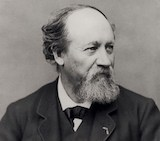

<!-- _class: cover -->

# 三菱一号美術館 イスラエル博物館所蔵 印象派・光の系譜

## 三菱一号美術館

- 19世紀の近代美術を中心とする美術館。
- 企画展を年間3回開催。
- 赤煉瓦が特徴的な建物
- 1894年にジョサイア・コンドルが設計した三菱一号館を復元
- <https://mimt.jp/>

## 印象派・光の系譜展

- 日本初！イスラエル博物館が所蔵する印象派の名品選
- 印象派の光の系譜をたどる珠玉の作品群
- モネ、ファン・ゴッホ、ゴーガンetc...画家達のピーク時の傑作が一堂に見られる
- イスラエル博物館：<https://www.imj.org.il/en>
- <https://mimt.jp/israel/>

## Artist

| Artist | Artist | Artist |
|:--|:--|:--|
| アルフレッド・シスレー | アルマン・ギヨマン | ウジェーヌ・ブーダン |
| エドゥアール・ヴュイヤール | エドガー・ドガ | エミール・ベルナール |
| オディロン・ルドン | ール・ピエール・ドービニー | カミーユ・ピサロ|
| ギュスターヴ・クールベ | クロード・モネ | シャルル=フランソワ・ドービニー |
| ジャン=バティスト・カミーユ・コロー | チャイルド・ハッサム | テオ・ファン・レイセルベルヘ |
| ピエール・ボナール | ピエール=オーギュスト・ルノワール | フィンセント・ファン・ゴッホ |
| ポール・ゴーガン | ポール・シニャック | ポール・セザンヌ |
| ポール・セリュジエ | ヨハン・バルトルト・ヨンキント | レッサー・ユリィ |

### アルフレッド・シスレー

Alfred Sisley(1839-1899)

- フランス生まれイギリス人の画家
- パリ周辺を題材の風景画が多い
- 終始一貫、印象派画法を保ち続ける
- 典型的な印象派の画家

[[Wikipedia](https://ja.wikipedia.org/wiki/アルフレッド・シスレー)]

#### サン=マメス、ロワン川のはしけ(1884)

Barges on the Loing at Saint-Mammès

- Oil on canvas
- 47.0×55.9
- 1884
- L-B06.0024

#### サン=マメス、ロワン川のはしけ(1885)

Barges on the Loing at Saint-Mammès

- Oil on canvas
- 55.2×73.7
- 1885
- B00.1707

### アルマン・ギヨマン

Armand Guillaumin(1841 - 1927)

- パリの生まれフランス印象派の画家
- パリ、クルーズ、エステレル地域の風景で有名
- 強烈な色彩で知られる

[[Wikipedia](https://ja.wikipedia.org/wiki/アルマン・ギヨマン)]
[[Israel Museum](ttps://www.imj.org.il/en/artistec/armand-guillaumin)]

#### 川の景色

- River Scene
- Oil on canvas
- 65.5×81.7
- ca. 1890
- B02.1559

[[Israel Museum](https://www.imj.org.il/en/collections/192771)]

### ウジェーヌ・ブーダン

Eugène Boudin(1824 - 1898)

- 19世紀フランスの画家
- 外光派の一人として印象派に影響を与える
- 青空と白雲の表現に優れる

[[Wikipedia](https://ja.wikipedia.org/wiki/ウジェーヌ・ブーダン)]
[[IsraelMuseum](https://www.imj.org.il/en/artistec/eug%C3%A8ne-boudin)]

#### 川辺の洗濯女たち

- Washerwomen by the River
- Oil on wood panel
- 26.2 x 36.2
- ca. 1880-1885
- B74.0387
- [WikipediaCommons](https://commons.wikimedia.org/wiki/File:Eug%C3%A8ne_Boudin_-_Washerwomen_by_the_River_-_Google_Art_Project.jpg)

#### 岸辺のボート

- Boat on Shore
- Oil on wood panel
- 24.0 x 18.5
- Undated
- Accession number:B97.0488
- [Israel Museum](https://www.imj.org.il/en/collections/194101)

#### 港に近づくフリゲート艦

- Frigates Approaching the Port
- Oil on canvas
- 45.7 x 65.5
- 1894
- L-B95.048

### エドゥアール・ヴュイヤール

Édouard Vuillard(1868 - 1940)

- 19世紀-20世紀のフランスの画家
- ナビ派の1人
- 他ナビ派より平面的、装飾的傾向が顕著
- 室内情景など、身近な題材を好んで描く

[[Wikipedia](https://ja.wikipedia.org/wiki/エドゥアール・ヴュイヤール)]
[[IsraelMuseum](https://www.imj.org.il/en/artistec/edouard-vuillard)]

### エドガー・ドガ

Edgar Degas(1834 - 1917)

- フランスの印象派の画家、彫刻家
- アングル派ルイ・ラモートに師事
- ルネサンスの巨匠やアングルの画風
- 室内風景を描いたものが多い

[[Wikipedia](https://ja.wikipedia.org/wiki/エドガー・ドガ)]
[[IsraelMuseum](https://www.imj.org.il/en/artistec/edgar-degas)]

### エミール・ベルナール

Émile Bernard(1868 - 1941)

- フランスのポスト印象派の画家
- 点描、クロワゾニスム（ポスト印象派）、総合主義（サンテティスム）

[[Wikipedia](https://ja.wikipedia.org/wiki/エミール・ベルナール_(画家))]
[[IsraelMuseum](https://www.imj.org.il/en/artistec/emile-bernard)]

### オディロン・ルドン

Odilon Redon(1840-1916)

- フランス人画家
- 20歳の頃、植物学者アルマン・クラヴォーと知り合う
- 版画には植物学の影響が見られる
- もっぱら幻想の世界を描き続けた

[[Wikipedia](https://ja.wikipedia.org/wiki/オディロン・ルドン)]
[[IsraelMuseum](https://www.imj.org.il/en/artistec/odilon-redon)]

### カール・ピエール・ドービニー

Karl Pierre Daubigny(1846 - 1886)

- バルビゾン派に属していたフランス画家

[Wikipedia](https://nl.wikipedia.org/wiki/Karl_Daubigny)

### カミーユ・ピサロ

Camille Pissarro(1830 - 1903)

- 19世紀フランスの印象派の画家
- 1860年台はコローにならった画風
- 1870年頃明るい色調の絵画を描くように
- 印象派展は全8回開かれたが、全てに参加したのはピサロだけ

[[Wikipedia](https://ja.wikipedia.org/wiki/カミーユ・ピサロ)]
[[IsraelMuseum](https://www.imj.org.il/en/artistec/camille-pissarro)]

#### 朝、陽光の効果、エラニー

- Morning, Sunlight Effect, Éragny
- Oil on canvas
- 66.0×81.7
- 1899
- Accession number:B87.0110
- [Wikipedia Commons](https://commons.wikimedia.org/wiki/File:Camille_Pissarro_-_Morning_Sunlight_Effect,_Eragny_-_Google_Art_Project.jpg)
- [Israel Museum](https://www.imj.org.il/en/collections/194484)

#### エラニーの日没

- Sunset at Éragny
- Oil on canvas
- 65.2×81.3
- 1890
- Accession number:B98.0700
- [Wikipedia Commons](https://commons.wikimedia.org/wiki/File:Camille_Pissarro_-_Sunset_at_Eragny_-_Google_Art_Project.jpg)
- [Israel Museum](https://www.imj.org.il/en/collections/193404)

#### ポントワーズの工場

- The Factory at Pontoise
- Oil on canvas
- 38.0×55.0
- 1873
- B95.1012
- [[Wikipedia Commons](https://commons.wikimedia.org/wiki/File:Camille_Pissarro_-_The_Factory_at_Pontoise_-_Google_Art_Project.jpg)]
- [[Israel Museum](https://www.imj.org.il/en/collections/194208)]

#### テュイルリー宮庭園、午後の陽光

- The Tuileries Gardens, Afternoon, Sun
- Oil on canvas
- 74.4×91.9
- 1900
- B95.0800
- [[WikiArt](https://www.wikiart.org/en/camille-pissarro/the-tuileries-gardens-afternoon-sun-1900)]
- [[Israel Museum](https://www.imj.org.il/en/collections/193405)]

### ギュスターヴ・クールベ

Gustave Courbet(1819 - 1877)

- フランスの写実主義の画家
- 代表作は、『オルナンの埋葬』と『画家のアトリエ』
- グループ肖像画、森の中の動物を主題にした風景画、官能的な裸婦像などにも傑作を残している

[[Wikipedia](https://ja.wikipedia.org/wiki/ギュスターヴ・クールベ)]
[[IsraelMuseum](https://www.imj.org.il/en/artistec/gustave-courbet)]

### クロード・モネ

Claude Monet(1840 - 1926)

- 印象派を代表するフランスの画家
- 代表作『印象・日の出』は印象派の名前の由来
- 1898年ごろから睡蓮の池を集中的に描くようになった

[[Wikipedia](https://ja.wikipedia.org/wiki/クロード・モネ)]
[[IsraelMuseum](https://www.imj.org.il/en/artistec/claude-monet)]

### シャルル=フランソワ・ドービニー

Charles-François Daubigny(1817 - 1878)

- フランスの画家
- モネなどの後に印象派を形成する事になる若い画家たちを積極的に評価
- バルビゾン派の一人に数えられ、印象派につながる重要な先駆けを果たした

[[Wikipedia](https://ja.wikipedia.org/wiki/シャルル＝フランソワ・ドービニー)
[[IsraelMuseum](https://www.imj.org.il/en/artistec/charles-francois-daubigny)]

### ジャン=バティスト・カミーユ・コロー

Jean-Baptiste-Camille Corot(1796 - 1875)

- 19世紀のフランスの画家
- バルビゾン派の七星の一人
- 次世代の印象派との橋渡しをした画家
- 詩情あふれる森や湖の風景画で知られる

[[Wikipedia](https://ja.wikipedia.org/wiki/ジャン＝バティスト・カミーユ・コロー)]
[[IsraelMuseum](https://www.imj.org.il/en/artistec/jean-baptiste-camille-corot)]

#### 舟上の釣り人

- Fisherman in His Boat
- Oil on canvas
- 43.0x64.8
- 1870-1872
- B98.0698

### チャイルド・ハッサム

Childe Hassam(1859 - 1935)

- アメリカにおける印象派の代表的画家
- ボストンやその郊外の風景画を描き、1882年には50点の水彩画を展示した個展
- 1884年にヨーロッパの風景を描いた67点の水彩画をボストンで展示

[[Wikipedia](https://ja.wikipedia.org/wiki/フレデリック・チャイルド・ハッサム)]
[[IsraelMuseum](https://www.imj.org.il/en/artistec/childe-hassam)]

#### 夏の陽光（ショールズ諸島）

.jpg)

- Summer Sunlight (Isles of Shoals)
- Oil on canvas
- 61.5×51.4
- 1892
- B55.05.2605
- [[Israel Museum](https://commons.wikimedia.org/wiki/File:Childe_Hassam_-_Summer_Sunlight_(Isles_of_Shoals)_-_Google_Art_Project.jpg)]

### テオ・ファン・レイセルベルヘ

Théo van Rysselberghe(1862 - 1926)

- ベルギーの画家
- 1883年に設立された「20人展」の創立メンバーの一人
- [[Wikipedia](https://ja.wikipedia.org/wiki/テオ・ファン・レイセルベルヘ)]
- [[Israel Museum](https://www.imj.org.il/en/artistec/theo-van-rysselberghe)]

#### 地中海、ル・ラヴァンドゥー

- The Mediterranean at Le Lavandou
- Oil on canvas
- 65.5×81.5
- 1904
- B92.1430
- [[Wikimedia Commons](https://commons.wikimedia.org/wiki/File:Th%C3%A9o_van_Rysselberghe_-_The_Mediterranean_at_Le_Lavandou_-_Google_Art_Project.jpg)]
- [[Israel Museum](https://www.imj.org.il/en/collections/194146)]

### ピエール・ボナール

Pierre Bonnard(1867 - 1947)

- ナビ派に分類されるフランス画家
- ポスト印象派とモダンアートの中間点に位置する画家のひとり
- 日本美術の影響を強く受け、日本かぶれのナビと呼ばれた

[[Wikipedia](https://ja.wikipedia.org/wiki/ピエール・ボナール)]
[[IsraelMuseum](https://www.imj.org.il/en/collections/194059)]

### ピエール=オーギュスト・ルノワール

Pierre-Auguste Renoir(1841 - 1919)

- フランスの印象派の画家
- 後期から作風に変化が現れ始めたため、ポスト印象派の画家の一人として挙げられることも
- 温かい色調の女性裸体画を数多く制作

[[Wikipedia](https://ja.wikipedia.org/wiki/ピエール＝オーギュスト・ルノワール)]
[[IsraelMuseum](https://www.imj.org.il/en/artistec/pierre-auguste-renoir)]

### フィンセント・ファン・ゴッホ

Vincent van Gogh(1853 - 1890)

- オランダのポスト印象派の画家
- 主要作品の多くは1886年以降のフランス居住時代
- 感情の率直な表現、大胆な色使いで知られる
- ポスト印象派を代表する画家

[[Wikipedia](https://ja.wikipedia.org/wiki/フィンセント・ファン・ゴッホ)]
[[IsraelMuseum](https://www.imj.org.il/en/artistec/vincent-van-gogh)]

### ポール・ゴーガン

Paul Gauguin(1848 - 1903)

- フランスのポスト印象派の画家
- フォークアートと日本の浮世絵の影響を受けながら、クロワゾニスムに向う
- 形態と色彩のどちらかが優位に立つのではなく、両者が等しい役割を持つ綜合主義に向かっていく

[[Wikipedia](https://ja.wikipedia.org/wiki/ポール・ゴーギャン)]
[[IsraelMuseum](https://www.imj.org.il/en/artistec/paul-gauguin)]

### ポール・シニャック

Paul Signac(1863 - 1935)

- 19世紀～20世紀のフランスの画家
- 新印象派の代表的画家
- スーラから大きな影響を受けている
- スーラの没後はモネの影響がはっきり現れる

[[Wikipedia](https://ja.wikipedia.org/wiki/ポール・シニャック)]
[[IsraelMuseum](https://www.imj.org.il/en/artistec/paul-signac)]

#### サモワの運河、曳舟

- The Tugboat, Canal at Samois
- Oil on canvas
- 66.0×82.0
- 1901
- B94.0600
- [Wikimedia Commons](https://commons.wikimedia.org/wiki/File:Paul_Signac_-_The_Tugboat,_Canal_in_Samois_-_Google_Art_Project.jpg)

### ポール・セザンヌ

Paul Cézanne(1839 - 1906)

- フランスの画家
- 印象派のグループの一員として活動していたが伝統的な絵画の約束事にとらわれない独自の絵画様式を探求
- しばしば「近代絵画の父」として言及

[[Wikipedia](https://ja.wikipedia.org/wiki/ポール・セザンヌ)]
[[IsraelMuseum](https://www.imj.org.il/en/artistec/paul-cezanne)]

### ポール・セリュジエ

Paul Sérusier(1864 -1927)

- フランス出身のポスト印象派の画家
- ナビ派の一員として知られている

[[Wikipedia](https://ja.wikipedia.org/wiki/ポール・セリュジエ)]
[[IsraelMuseum](https://www.imj.org.il/en/artistec/paul-s%C3%A9rusier)]

### ヨハン・バルトルト・ヨンキント

Johan Barthold Jongkind(1819 - 1891)

- オランダの画家、版画家
- モネに影響を及ぼした印象主義の先駆者

[[Wikipedia](https://ja.wikipedia.org/wiki/ヨハン・ヨンキント)]
[[IsraelMuseum](https://www.imj.org.il/en/artistec/johan-barthold-jongkind)]

#### 日没の運河、風車、ボート

- Canal, Windmill, Boat at Sunset
- Oil on wood panel
- 15.6×25.0
- 1866-1876
- B94.0603

### レッサー・ユリィ

Lesser Ury(1861 - 19319)

- ドイツ印象派の画家兼版画家
- 風景、都市の風景、インテリアシーンを題材とした作品が多い
- 夜の街灯の効果、夏の空を背景にした葉の光まで、印象派の方法で作成

[[Wikipedia](https://en.wikipedia.org/wiki/Lesser_Ury)]
[[IsraelMuseum](https://www.imj.org.il/en/artistec/lesser-ury)]

#### 風景

- Landscape
- Oil on canvas
- 101.5×71.0
- ca. 1900
- B15.0267

#### 冬のベルリン

- Winter Day in Berlin
- Oil on canvas
- 71.0×53.0
- Mid-1920s
- B50.06.2768
- [Israel Museum](https://www.imj.org.il/en/collections/193544)

#### 夜のポツダム広場

- Potsdam Square by Night
- Oil on canvas
- 79.6×100.0
- Mid-1920s
- B55.04.1775
- [IsraelMuseum](https://www.imj.org.il/en/collections/192669)

#### 赤い絨毯

- The Red Carpet
- Oil on canvas
- 100.0×66.0
- 1889
- B50.11.0016

## Fin
